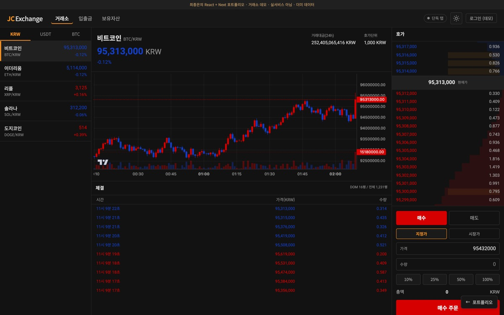
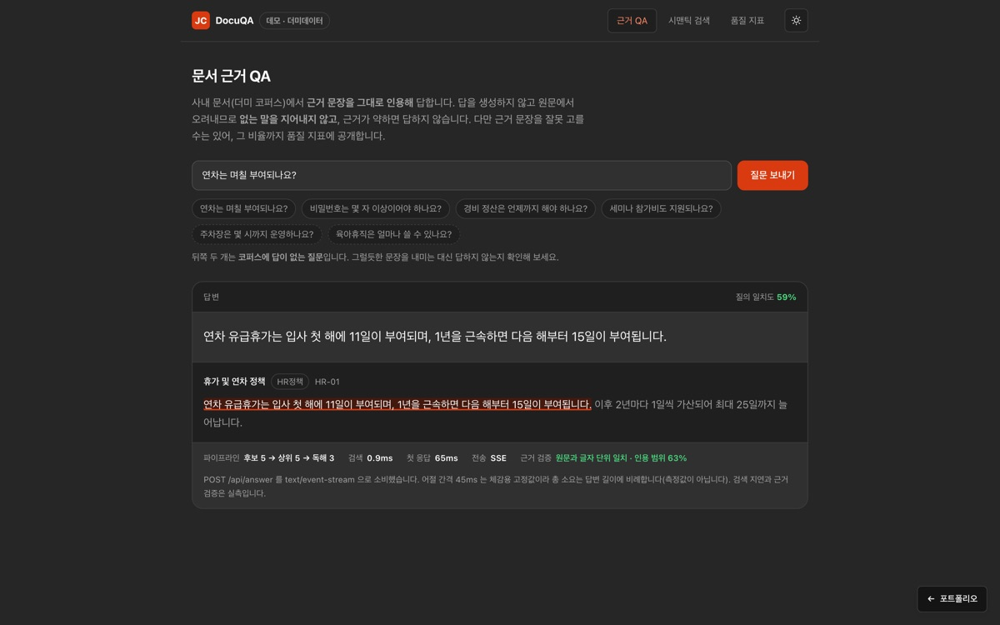
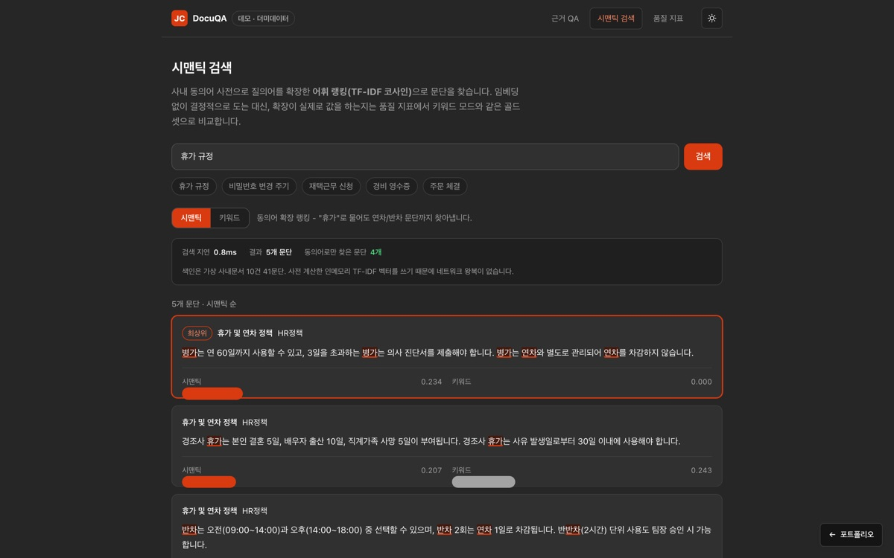
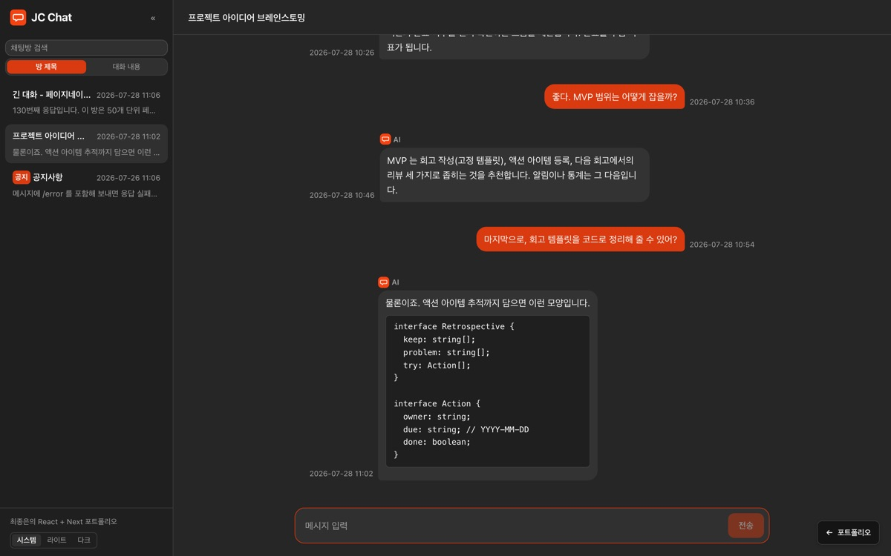
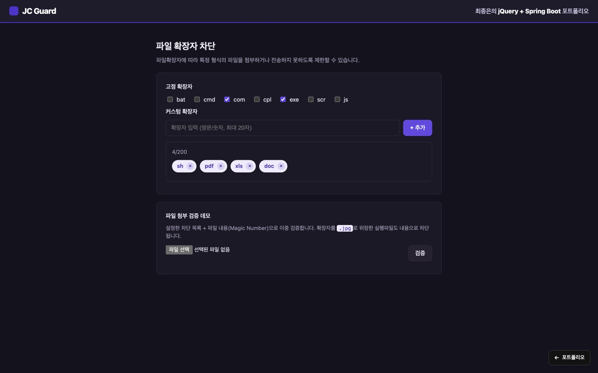
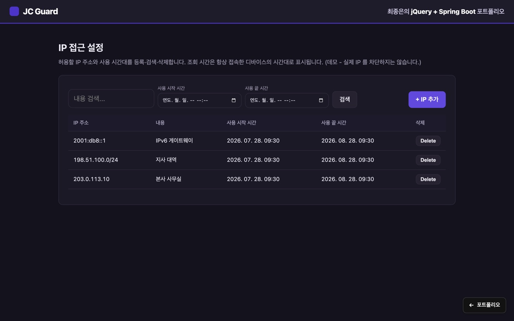
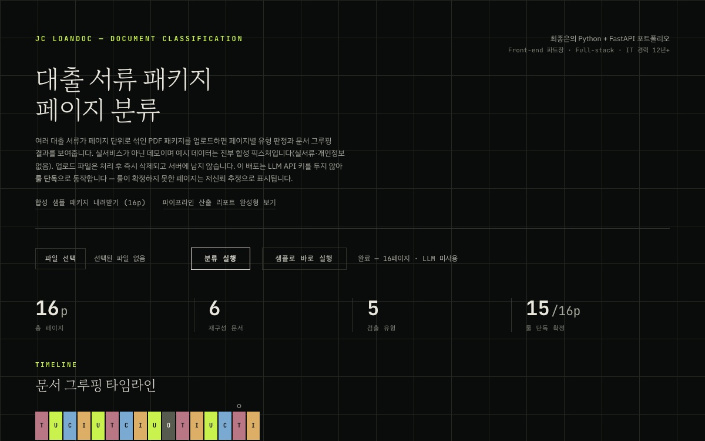
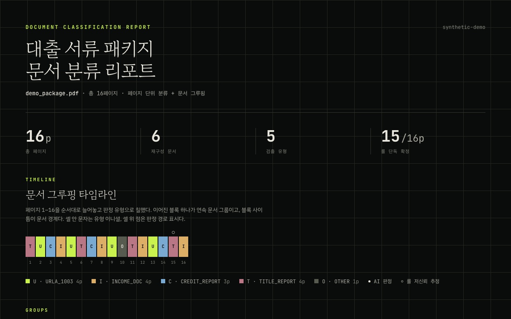
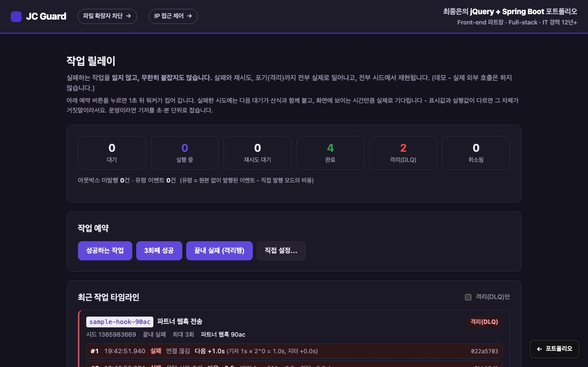

# 포트폴리오 - 프론트엔드 / 백엔드 상보 세트

프론트엔드와 백엔드, 두 축의 개인 포트폴리오 저장소입니다.
한쪽은 프론트엔드와 UX, 다른 한쪽은 백엔드와 보안 및 인프라에 무게를 두어,
합치면 풀스택 폭을 한 링크로 보여주는 구성입니다.

## 개발자 소개

프론트엔드 파트를 리딩하며 웹 앱 백엔드를 아우르는 풀스택 개발자 최종은입니다.
검증(QA)과 조율(PM), 구현(개발)을 모두 거친 개발 리더로, IT 경력 12년 넘게
프론트엔드를 중심으로 화면부터 서버, 인프라와 보안까지 하나의 흐름으로 다뤄 왔습니다.

- 경력 구성(2026-07 기준): 프론트엔드 개발 7년 7개월(그중 풀스택 개발 10개월 · 프론트엔드 파트 리딩 10개월), System QA 3년, Tech PM 2년 1개월
- 대표 성과: 거래소 웹 개인 커밋 1,700+ (약 36%), Brotli 전송량 최대 86% 절감, Lighthouse 성능 60 -> 99 / SEO 80 -> 100, 글로벌 앱 다운로드 50만+
- 인트로 페이지: **[jongeunchoi.dev](https://jongeunchoi.dev/)** - 경력, 기술 스택, 대표 프로젝트와 아래 데모를 한 화면에 모은 랜딩

아래 코드 데모들이 이 포트폴리오의 코드 근거입니다(4개 폴더, 8개 데모).

| 폴더 | 데모 | 스택 | 무게중심 | 라이브 | 테스트 |
|------|------|------|----------|--------|--------|
| `portfolio_react_next` | LLM 챗봇 목업 | Next 16 / React 19 / TS, pnpm + Turborepo | 프론트엔드, UX, 스트리밍, 접근성, 키 게이트 LLM 전송 | [chat](https://chat.jongeunchoi.dev/) | 단위 149 + e2e 4 |
| `portfolio_react_next/apps/docqa` | 문서 근거 QA + 시맨틱 검색 (JC DocuQA) | Next 16 / React 19 / TS, 결정적 TF-IDF 색인 | 리트리벌, 추출형 MRC, 근거·인용, 품질 계측 | [docqa](https://docqa.jongeunchoi.dev/) | 단위 55 |
| `portfolio_exchange_next` | 가상자산 거래소 목업 | Next 16 / React 19 / TS, lightweight-charts | 매칭엔진, 실시간, 성능, 멀티탭 | [exchange](https://exchange.jongeunchoi.dev/) | 단위 54(RTL 포함) |
| `portfolio_jquery_spring` | 파일 확장자 차단 + IP 접근 제어 + 작업 릴레이 | Spring Boot 4.1 / Java 21, jQuery 4 + TS/webpack | 백엔드, 동시성, 보안, 관측성, 배포 | [file](https://file.jongeunchoi.dev/) · [ip](https://ip.jongeunchoi.dev/) · [relay](https://guard.jongeunchoi.dev/relay.html) | 백엔드 189 + 통합 6종 24 + 프론트 33 |
| `portfolio_python_fastapi` | 대출 서류 분류 파이프라인 (JC LoanDoc) | Python 3 / FastAPI, pypdf | 문서 파이프라인, 룰 + LLM 폴백 하이브리드, 재현성 | [loandoc](https://loandoc.jongeunchoi.dev/) | 단위 58 + E2E 스모크 |

여덟 데모가 한 대의 EC2 에 삽니다(인트로는 apex, 데모는 서브도메인 일곱 - 문서 QA 와 시맨틱 검색이 한 앱의 두 화면이고, 작업 릴레이는 guard. 서브도메인의 경로입니다). 각 폴더는 독립적으로 빌드, 실행, 배포됩니다. 상세 설계와 단계별 기록, 각 기능의 "무엇을 왜" 는 각 폴더의 README 에 절 단위로 있습니다. 인트로의 데모 링크는 주소를 적어 두지 않고 **지금 페이지의 호스트에서 조립**합니다 - 도메인이면 서브도메인을, IP 면 포트를 만들어 붙이므로 어느 쪽으로 접속해도 맞고 서버가 바뀌어도 고칠 곳이 없습니다(로컬에서는 각 카드의 개발 포트를 씁니다).

## 화면

| | |
|---|---|
| **거래소** - 호가 20단, 캔들, 주문 폼, 체결 | **문서 근거 QA** - 근거 문장 인용 + 품질 지표 |
|  |  |
| **시맨틱 검색** - 동의어 확장 랭킹 | **AI 챗봇** - 어절 스트리밍, 대화 검색 |
|  |  |
| **파일 확장자 차단** - 내용 기반 이중 검증 | **IP 접근 제어** - 키셋 페이지네이션, 정책 평가, 디바이스 TZ |
|  |  |
| **대출 서류 분류** - 업로드 즉시 페이지 분류·그룹핑 | **분류 리포트** - 같은 파이프라인의 완성형 정적 산출물 |
|  |  |
| **작업 릴레이** - 멱등 예약, 백오프 타임라인, 아웃박스 | |
|  | |

---

## portfolio_react_next - LLM 챗봇 목업

React + Next 포트폴리오. 서버 없이 클라이언트 Mock API 와 localStorage 만으로
실제 채팅 서비스의 동작(지연, 실패, 스트리밍, 페이지네이션)을 재현합니다.

- 역방향 무한 스크롤을 scroll anchoring 으로 구현해, 이전 페이지를 앞에 붙여도 화면이 밀리지 않습니다.
- 응답 텍스트를 어절 단위로 순차 페이드인 합니다(Intl.Segmenter 분절, prefers-reduced-motion 존중).
- 스트리밍 전환을 미리 수용한 스키마(ReplyEvent 스트림)로, `/stream` 데모가 같은 소비 코드로 증분 응답을 시연합니다.
- **키 게이트 LLM 전송 모드**: 서버에 `ANTHROPIC_API_KEY` 가 있으면 같은 SSE 계약으로 실제 Claude 가 답하고, 없으면(배포 기본) 결정적 목업으로 폴백합니다. 결정성 캐시가 재연결 이어받기를 보존하고, 화면 문구도 모드를 따라갑니다.
- **대화 검색**: 모든 방의 메시지를 관련도 순으로 찾고, 결과를 누르면 그 메시지가 나올 때까지 과거 페이지를 되짚어 **스크롤 앵커링을 깨지 않고** 그 자리로 데려갑니다. 검색 엔진은 DocuQA 데모에서 만든 `@chat/search-domain` 을 인스턴스로 재사용합니다.
- 다크 모드, 반응형, 스킵 링크, aria-live, 포커스 복원 등 접근성을 기본값으로 둡니다.
- 지원 브라우저 Chrome 111+ (ES2022 상한)를 빌드 산출물까지 검증합니다.
- 상세: [portfolio_react_next/README.md](portfolio_react_next/README.md)

로컬 실행 (Node 22.22.2+ / 24.15+ / 26+, pnpm 은 corepack 으로 준비):

```bash
cd portfolio_react_next
pnpm install
pnpm dev          # http://localhost:3000
```

### apps/docqa - 문서 근거 QA + 시맨틱 검색 (JC DocuQA)

같은 모노레포의 두 번째 앱. 한 앱에 두 제품 표면(인트로 카드 2장)을 두고, 공유 인프라
(가상 사내문서 코퍼스 + 결정적 색인) 위에 검색과 QA 를 각각 얹었습니다.

- `/` **근거 QA** - 리트리벌 -> **추출형 MRC**(생성이 아니라 문단에서 오려내기) -> 근거 span 하이라이트 + 인용 + 스트리밍. 근거가 약하면 지어내지 않고 "정답 없음".
- `/search` **시맨틱 검색** - 동의어 확장 랭킹과 **키워드 점수 대비**. "휴가 규정"은 시맨틱 5건 중 4건이 정확 일치로는 못 찾을 문단입니다.
- `/eval` **품질 지표** - 직접 라벨링한 **골드셋 33문항**으로 Recall@k·MRR·답변 정확도·**불응답 정확도**를 재고, 오답과 과잉 불응답까지 같은 표에 공개합니다. 이 수치는 테스트의 **회귀 게이트**이기도 합니다.
- **실 LLM/벡터DB 없이**, 답변이 인용 문단과 축자 일치하는지 매 응답 대조(`verifyGrounding`)해 배지로 노출합니다 - 지어낸 말이 섞이면 즉시 드러납니다. "근거 문장을 잘못 고를 수 있다"는 한계는 숨기지 않고 `/eval` 에 수치로 둡니다.
- 답변은 실제 SSE(`POST /api/answer`)로 받고, 전송이 죽으면 같은 계약의 mock 으로 **중복 없이 이어받아** 강등합니다(전송은 배지에 정직하게 표시).
- 상세: [portfolio_react_next/README.md](portfolio_react_next/README.md) 의 부록

```bash
cd portfolio_react_next && pnpm --filter @chat/docqa dev   # http://localhost:3030
```

---

## portfolio_exchange_next - 가상자산 거래소 목업

Next + React 포트폴리오. 표시 전용 목업을 넘어 **주문이 실제로 체결되는** 프론트엔드입니다.

- 가격-시간 우선 한계 오더북 **매칭 엔진**(지정가/시장가/부분체결/자전거래 방지/주문 생애주기 상태머신)을 순수 TypeScript/decimal.js 로 구현하고, 주문 폼을 엔진에 배선해 잔고/포지션이 실제로 움직입니다(예약 회계).
- 시드 PRNG 로 mock 스트림을 **결정적**으로 만들고, 체결 테이프는 외부 라이브러리 없이 **가상화**(DOM 노드 상한 고정)합니다.
- 요청별 **nonce CSP**(strict-dynamic), **BroadcastChannel 멀티탭 시세 동기**(리더 선출/페일오버), 스크린리더 요약 라이브 리전/오더북 키보드 조작/reduced-motion 을 갖춥니다.
- 상세: [portfolio_exchange_next/README.md](portfolio_exchange_next/README.md)

```bash
cd portfolio_exchange_next
npm install && npm run dev     # http://localhost:3000
```

---

## portfolio_jquery_spring - 파일 확장자 차단 + IP 접근 제어 + 작업 릴레이

jQuery + Spring Boot 포트폴리오. 세 백엔드 데모를 한 앱에 담았습니다.

**파일 확장자 차단** - "실행파일 보안 위험" 문제 제기에 답해, 확장자만으로 부족한 지점을 파일 내용 검사(매직넘버 + Tika + 컨테이너 introspection)로 보완한 것이 핵심입니다.

- 커스텀 확장자 CRUD(정규화/이중 검증/200개 상한)와 200 경계 동시성(TOCTOU)을 교체 가능한 분산 락(in-process / MySQL GET_LOCK / Redisson) + TransactionTemplate 로 직렬화합니다.
- Micrometer 관측성(사유별 차단 계량)/구조화 로그, 속성 기반 테스트(jqwik), 격리 저장(웹루트 밖/UUID/실행비트 제거)을 갖춥니다.

**IP 접근 제어** - 허용 IP/사용 시간대 어드민.

- IPv4/IPv6/**CIDR 값객체**(RFC 5952 정규화/포함 매칭), 100만 건 **키셋 페이지네이션**(OFFSET vs keyset 벤치로 ~12배 실증), CIDR **범위 인덱스** 조회, 부분수정(PUT)+**낙관적 락**, append-only **감사 로그**, Micrometer 관측성, OpenAPI(springdoc).

**작업 릴레이** - 실패하는 외부 연동 작업의 재시도 파이프라인.

- **멱등키**로 중복 예약 차단, `FOR UPDATE SKIP LOCKED` **리스**로 워커 경쟁 분리, 지수 백오프+지터, **아웃박스 발행 vs 직접 발행**을 유령 이벤트 카운터로 나란히 비교, run 세대 컬럼으로 append-only 이력과 재처리 공존. 성패가 시드 기반 순수 함수라 같은 실패 타임라인을 결정적으로 재생합니다(jqwik 속성 + 실스케줄러 E2E + MySQL IT).

공통: Flyway(V1~V8) + Testcontainers 통합테스트, Caffeine 유계 TTL 캐시, 요청 상관 ID(MDC), CSP/보안 헤더, HTTPS(Let's Encrypt) 배포 하드닝(Lighthouse 4개 영역 100).

- 상세: [portfolio_jquery_spring/README.md](portfolio_jquery_spring/README.md)

```bash
cd portfolio_jquery_spring
./gradlew bootRun     # http://localhost:8080
```

---

## portfolio_python_fastapi - 대출 서류 분류 파이프라인 (JC LoanDoc)

Python + FastAPI 포트폴리오. 페이지 단위로 섞인 대출 서류 PDF 패키지를 받아
페이지별 유형 판별(URLA/소득/신용/권원/기타)과 문서 그룹핑을 수행합니다.
자동 인수심사(AUS)로 가는 파이프라인의 앞단 문제를 다룹니다.

- **2단 하이브리드** - 표준 양식의 고정 문구를 시그니처 룰로 먼저 확정하고(결정적·무비용·감사 가능), 룰이 못 정한 페이지만 LLM 폴백(텍스트/비전)에 맡깁니다. 두 판정은 독립입니다(앵커링 방지).
- **인입 게이트** - 파싱 전에 파일 내용(매직넘버)으로 거르고, 실행파일 위장은 구체적 사유로 거절합니다. 파일 확장자 차단 데모와 같은 원칙("내용 검사를 정책 검사보다 먼저")의 파이썬판입니다.
- **배포 데모는 LLM 키 없이 룰 단독** - 공개 서버에 상용 API 키를 두지 않습니다(시크릿 없음 원칙). 화면 데이터는 전부 합성 픽스처이고 업로드는 처리 후 즉시 삭제됩니다.
- 속성 기반 테스트(hypothesis)와 E2E 스모크(합성 픽스처, 재현성 바이트 대조)를 갖춥니다.
- 상세: [portfolio_python_fastapi/README.md](portfolio_python_fastapi/README.md)

로컬 실행 (Python 3.10+):

```bash
cd portfolio_python_fastapi
python3 -m venv .venv && source .venv/bin/activate
pip install -r requirements-web.txt
uvicorn webapp.app:app --port 8000    # http://localhost:8000
```

---

## 역량 축 - 여덟 데모를 관통하는 설계 서사

개별 기능을 넘어, 여러 데모를 **하나의 표준으로 다스린다**는 관점이 이 포트폴리오의 축입니다.
각 항목의 코드 근거는 해당 앱 README 의 해당 절에 있습니다.

- **관측성 대칭** - IP 모듈에 넣은 Micrometer 계량/상관 ID(MDC)/구조화 로그/안전한 actuator 노출을, 같은 표준으로 파일 검증 경로에도 이식했습니다. 상관 ID 필터는 한 번 만들어 전 모듈이 공유합니다.
- **테스트 3방향 심화** - 예제 테스트에서 **속성 기반**(jqwik: 정규화 멱등/임의 입력 무크래시)으로, 고립 테스트에서 **실경로 통합 IT**(실제 MySQL GET_LOCK 이 서비스 임계 구역을 직렬화)로, 순수 로직에서 **컴포넌트/RTL/프론트 단위**로 위를 채웠습니다.
- **API 성숙** - 부분수정(PUT) + 낙관적 락(@Version) + OpenAPI(springdoc) 로 IP 어드민을 파일차단 모듈과 대칭 수준으로 끌어올렸습니다.
- **재사용 패턴** - 리스트 가상화(windowing)와 키셋 페이지네이션을 재사용 가능한 순수 유틸로 뽑아 앱 사이에 이식했습니다.
- **키 없는 배포에서 LLM 을 증명하는 법** - 두 AI 데모(대출 분류·챗)는 공개 서버에 API 키를
  두지 않습니다. 그러면 "연동 코드는 실재한다"는 말이 배포에서는 확인되지 않으므로, **실제
  응답을 산출물로 커밋해 재생**합니다(대출 분류는 요청 해시별 판정 캐시, 챗은 추천 질문별
  응답). 재생임을 화면이 밝히고, 그 밖의 입력은 룰/목업이 답한다고 말합니다 - 재생을
  실시간 호출인 척하지 않는 것이 이 장치의 전제입니다. 실시간 호출 장면은 키를 넣고 돌린
  로컬 실행을 짧은 영상으로 남겨 인트로에서 엽니다(파일이 없으면 링크는 조용히 숨습니다).

  ```bash
  # 영상 자산 자리(있을 때만 인트로에 링크가 뜹니다)
  intro/img/clip-loandoc-llm.mp4   # 대출 분류 - LLM 폴백이 저신뢰 페이지를 맡는 장면
  intro/img/clip-chat-llm.mp4      # 챗 - 실제 LLM 이 스트리밍으로 답하는 장면
  ```

- **정직한 판단** - "하는 것"만큼 **"안 하는 근거"** 를 남깁니다. 챗의 전면 가상화는 기존 스크롤 앵커링 e2e(오프스크린 앵커 측정)와 구조적으로 비양립임을 실측으로 확인하고, 근거 있는 미채택 결정으로 남겼습니다(코어 유틸은 추출/테스트 완료).

## 공통 원칙

네 폴더가 공유하는 작업 방식입니다.

- 측정한 뒤 최적화합니다. 근거 없는 최적화는 넣지 않습니다.
- 트레이드오프와 "하지 않은 것 + 이유" 를 README 에 남깁니다.
- 무작위 대신 결정적 동작을 택합니다. 같은 조작은 같은 결과를 냅니다.
- 보안과 정확성을 먼저 두고, 편의 기능은 그 다음에 얹습니다.

## 저장소 구조

```
portfolio/
├── intro/                      # 포트폴리오 인트로 랜딩 페이지 (자체완결 정적 HTML)
├── portfolio_react_next/       # Next / React 모노레포 (pnpm + Turborepo)
│   ├── apps/chat/              #   LLM 챗봇 목업
│   └── apps/docqa/             #   문서 근거 QA + 시맨틱 검색 (JC DocuQA)
├── portfolio_exchange_next/    # Next / React 거래소 목업 (매칭 엔진)
├── portfolio_jquery_spring/    # jQuery / Spring 백엔드 (파일 차단 + IP 접근 제어)
├── portfolio_python_fastapi/   # Python / FastAPI 대출 서류 분류 파이프라인 (JC LoanDoc)
├── infra/                      # nginx 설정, systemd 유닛, 프로비저닝 / 배포 스크립트
├── tools/                      # 자산 생성 원본 (배포에 올라가지 않는 도구)
│   └── og-card/                #   공유 카드 원본 -> intro/img/og-cover.jpg
└── README.md
```

## 라이브 데모

```
https://jongeunchoi.dev/            인트로(랜딩)
https://exchange.jongeunchoi.dev/   JC Exchange
https://docqa.jongeunchoi.dev/      JC DocuQA        (+ /search, /eval)
https://chat.jongeunchoi.dev/       JC Chat
https://file.jongeunchoi.dev/       파일 확장자 차단
https://ip.jongeunchoi.dev/         IP 접근 제어
https://guard.jongeunchoi.dev/relay.html  작업 릴레이 (파일·IP 와 같은 앱)
https://loandoc.jongeunchoi.dev/    대출 서류 분류 (JC LoanDoc)
```

한 대의 EC2(t4g.small, arm64)에서 **443 한 포트**로 전부 서빙합니다. SNI 로 서브도메인을 가르고,
열 이름을 한 장(SAN)에 담은 Let's Encrypt 인증서를 씁니다.

도메인 이전에는 IP 리터럴에 직접 TLS 를 걸었습니다 - SNI 가 없어 서브도메인을 못 쓰고 앱들이
모두 `/api/*` 를 써 경로로도 못 나눠, **포트로** 갈랐습니다(`:8443` `:9443` `:9444` `:9445` `:9446`).
그 설정은 지금도 **함께 켜져 있습니다**. SNI 가 있으면 도메인 블록이, 없으면 기존 default_server 가
받으므로 `https://<ip>/` 로도 그대로 열립니다 - 도메인이 만료돼도 데모가 죽지 않습니다.

링크가 열리지 않으면 데모 리소스가 정리된 상태일 수 있습니다.
서버 구성과 배포 파이프라인은 [infra/README.md](infra/README.md) 에 있습니다.

## 원본 저장소와 재배포 방침

이 모노레포가 두 프로젝트의 단일 진실원입니다. 초기 작업의 원본 저장소는
읽기 전용 아카이브로 보존하며 더 이상 갱신하지 않고, 이후 작업과 라이브 데모 재배포는
이 저장소를 기준으로만 이루어집니다.

## 라이선스

개인 포트폴리오 저장소로, 모든 권리를 보유합니다(All rights reserved).
열람과 평가 목적으로만 공개하며, 코드의 복제, 재사용, 재배포를 허용하지 않습니다.
