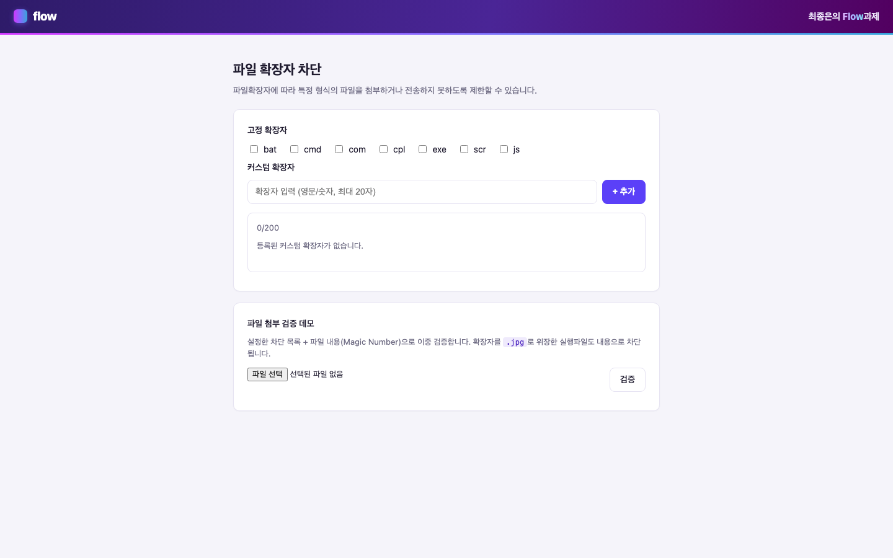

# 파일 확장자 차단 서비스

파일 확장자에 따라 특정 형식의 파일 첨부, 전송을 제한하는 서비스입니다.
고정 확장자 토글과 커스텀 확장자 CRUD를 제공하며, "확장자 차단만으로는 부족하다"는
보안 관점을 파일 내용(Magic Number) 검증 데모로 함께 구현했습니다.

### 라이브 데모 - **[파일 확장자 차단](https://file.jongeunchoi.dev)** · **[IP 접근 제어](https://ip.jongeunchoi.dev)**

별도 설치 없이 바로 확인하실 수 있습니다. 아래 "실행 방법"으로 로컬 구동도 가능합니다.
세 화면(파일 확장자 차단·IP 접근 제어·작업 릴레이)은 한 애플리케이션이며, 배포에서 주소로만 나눠 두었습니다.



| | |
|---|---|
| **Backend** | Java 21, Spring Boot 4.1, Spring Data JPA |
| **Frontend** | jQuery 4.0 + TypeScript (webpack 번들), REST/Ajax (SSR 아님) |
| **DB** | 로컬/테스트 H2(무설정) / 프로덕션 MySQL 8 |
| **Deploy** | AWS EC2 + Nginx(리버스 프록시) + systemd, HTTPS(Let's Encrypt) |
| **테스트** | 단위/슬라이스 189개(H2, 무설정) + 통합 6종 24개(Testcontainers 실제 MySQL 8, CI 실행) |

---

## 핵심 기능 - 명세와 구현 대응

| 기능 | 구현 | 확인 방법 |
|------|------|-----------|
| 고정 확장자 7종(bat/cmd/com/cpl/exe/scr/js), **기본 uncheck** | `DataInitializer` 시드(`blocked=false`) | 화면 상단 체크박스 / `GET /api/extensions/fixed` |
| 고정 확장자 체크/해제 시 **DB 저장, 새로고침 유지** | `FixedExtensionService.toggle` + `fixed_extension.is_blocked` | 체크 후 새로고침 |
| 커스텀 확장자 **최대 20자** | 프론트 `maxlength` + Bean Validation `@Size(20)` + 서비스 재검증 | 21자 입력 시 거부 |
| 커스텀 확장자 **추가 -> DB 저장 -> 하단 표시** | `POST /api/extensions/custom` (201) | 입력 후 "+ 추가" |
| 커스텀 확장자 **최대 200개** | `CustomExtensionService.MAX_CUSTOM` + 동시성 제어 | 카운터 `n/200`, 초과 시 422 |
| 커스텀 확장자 **삭제(X)** | `DELETE /api/extensions/custom/{id}` (204) | 칩의 ✕ 클릭 |
| 중복 체크 등 **명세에 없는 판단** | 아래 "설계 판단 기록" 29개 항목 | - |

---

## 실행 방법

```bash
# 1) 로컬 실행 (H2 인메모리 - 별도 DB 설치 불필요)
./gradlew bootRun
# -> http://localhost:8080  (H2 콘솔: /h2-console, JDBC URL: jdbc:h2:mem:extdb)
# -> 헬스체크: curl http://localhost:8080/actuator/health  -> {"status":"UP"}

# 2) 테스트
./gradlew test            # 리포트: build/reports/tests/test/index.html

# 3) 빌드 & 프로덕션(MySQL) 실행
./gradlew clean build
DB_HOST=... DB_NAME=extdb DB_USER=... DB_PASSWORD=... \
  java -jar build/libs/extension-block-0.0.1-SNAPSHOT.jar --spring.profiles.active=prod

# 4) 프론트엔드(TypeScript + SCSS) 재빌드 - 수정 시에만 필요
./gradlew webpackBuild        # Gradle 이 로컬 Node 자동 다운로드 -> webpack 번들 재생성
#   또는  cd frontend && npm ci && npm run build
```

> **번들을 저장소에 커밋해 둔 이유**: `./gradlew bootRun` / `test` 를 **Node 설치 없이 바로** 실행하실 수
> 있도록, 프론트엔드 산출물(`static/js/bundle.<hash>.js` / `static/css/style.<hash>.css` 와 두 파일명이
> 주입된 `static/index.html`)을 함께 커밋했습니다. 프론트엔드 소스는
> [frontend/src](frontend/src)(`app.ts` / `types.ts` / `styles/*.scss` / `index.html` 템플릿)이며,
> 산출물은 위 4) 명령으로만 생성됩니다.
> 일반적으로 빌드 산출물 커밋은 지양되나, **무설정 실행을 우선한 의도적 선택**입니다(14번에 근거 정리).

프로덕션 스키마는 **Flyway 마이그레이션**([db/migration](src/main/resources/db/migration))이 기동 시 자동 적용합니다(`prod` 프로파일). 로컬/테스트(H2)는 Flyway 를 끄고 Hibernate `create-drop` 으로 무설정 실행합니다.

---

## REST API

| Method | URI | 설명 | 성공 | 실패 |
|--------|-----|------|------|------|
| GET | `/api/extensions/fixed` | 고정 확장자 목록 + blocked 상태 | 200 | - |
| PATCH | `/api/extensions/fixed/{name}` | 토글 `{"blocked": true}` | 200 | 404 |
| GET | `/api/extensions/custom` | 커스텀 목록 + count + limit | 200 | - |
| POST | `/api/extensions/custom` | 추가 `{"name": "sh"}` | 201 | 400 / 409 / 422 |
| DELETE | `/api/extensions/custom/{id}` | 삭제 | 204 | 404 |
| POST | `/api/files/validate` | 파일 검증 데모(multipart `file`) | 200 | - |

**상태 코드 설계**: 형식 오류 `400`, 중복 `409`(Conflict), 개수 초과 `422`(문법은 맞으나 처리 불가)로
의미를 구분합니다. 모든 예외는 `GlobalExceptionHandler`에서 `{code, message}`로 일원화됩니다.

---

## 프로젝트 구조

```
src/main/java/com/portfolio/extension/
├── controller/   Fixed, Custom, FileValidation (REST)
├── service/      검증, 정규화, 동시성, 파일검증 로직
├── repository/   Spring Data JPA
├── domain/       FixedExtension, CustomExtension
├── dto/          요청/응답 record
├── util/         ExtensionNormalizer
├── exception/    도메인 예외 + GlobalExceptionHandler(@RestControllerAdvice)
└── config/       DataInitializer(고정 7종 시드), SecurityHeadersFilter(CSP)
src/main/resources/static/   ── 전부 webpack 산출물(커밋됨). favicon 만 손관리 ──
                             index.html / js/bundle.<hash>.js / css/style.<hash>.css / favicon.*
frontend/                    프론트엔드 소스 + 빌드 설정 (jQuery 유지)
├── src/app.ts               UI 로직 (TypeScript). 엔트리에서 styles/main.scss 를 import
├── src/types.ts             백엔드 DTO 대응 타입
├── src/styles.d.ts          .scss import 앰비언트 선언 (부수효과 전용)
├── src/index.html           HTML 템플릿 (HtmlWebpackPlugin)
├── src/styles/              SCSS - BEM 블록당 파일 1개
│   ├── _tokens.scss         팔레트(Sass 변수) -> :root 커스텀 프로퍼티 방출
│   ├── _mixins.scss         inline-center / control-border / focus-ring
│   ├── _base.scss           리셋/body      ├── _layout.scss   .app
│   ├── main.scss            @use 조립(= 출력 순서)
│   └── components/          brand-banner / card / form / button / chips / file-result / toast
├── webpack.config.js        app.ts -> bundle.<hash>.js, scss -> style.<hash>.css, 해시명 HTML 주입
├── tsconfig.json            strict
└── package.json             jquery@4, typescript, webpack, ts-loader, sass
src/test/java/...            정규화, 검증, 동시성, 파일검증, 컨트롤러 계약, 보안헤더 테스트
```

---

## 배포 구성

라이브 데모(https://file.jongeunchoi.dev)의 실제 구성입니다.

```
                     [인터넷]
                         │  443 HTTPS (Let's Encrypt)  /  80 -> 301
                         ▼
 ┌──────────────────────────────────────────────────────────────┐
 │ EC2 t4g.small - Ubuntu 24.04 arm64, RAM 2GB + swap 2GB       │
 │                                                              │
 │   Nginx      0.0.0.0:80,443   SNI 로 서브도메인 분기         │
 │     │ proxy_pass                                             │
 │     ▼                                                        │
 │   Spring Boot  127.0.0.1:8080   systemd(portfolio-backend)   │
 │     │ JDBC                      JVM -Xmx320m, SerialGC       │
 │     ▼                                                        │
 │   MySQL 8      127.0.0.1:3306   Docker, buffer pool 96M      │
 │                                                              │
 │   (같은 호스트에 Next 데모 3개가 3000/3010/3030 으로 공존)   │
 └──────────────────────────────────────────────────────────────┘

 외부 개방: 80 / 443 뿐 (SSH 22 는 지정 IP 화이트리스트)
 앱(8080) / DB(3306) 는 루프백 전용 -> 외부에서 직접 도달 불가
```

이 서비스는 `file.` 과 `ip.` 두 서브도메인으로 노출되지만 **한 프로세스**입니다. nginx 가 TLS
핸드셰이크의 SNI 로 어느 이름으로 들어왔는지 구분해, `ip.` 의 루트만 `/ip.html` 로 바꿔 넘깁니다.

- **DB 선택**: 프리티어 비용과 단일 인스턴스 규모를 고려해 RDS 대신 **EC2 내 Docker MySQL 8** 을 사용합니다.
  (스키마는 **Flyway**([db/migration](src/main/resources/db/migration))가 기동 시 적용, 애플리케이션 프로파일은 `prod`)
- 한 대에 JVM 1 + MySQL 1 + Node 3 이 함께 사는 메모리 배분과 그 실측 근거, nginx/systemd 하드닝,
  배포 파이프라인은 [infra/README.md](../infra/README.md) 에 있습니다.
- 배포 보안에 대한 판단은 아래 **20번** 참고.

---

## 설계 판단 기록

기능을 만들면서 내린 판단과 그 근거입니다. 항목이 많아 주제별 목차를 먼저 둡니다.
**가장 핵심은 6번(확장자 차단의 한계)** 이며, 나머지는 "왜 그렇게 했는가"와
**하지 않기로 한 것의 근거**를 함께 적었습니다.

| 주제 | 항목 |
|------|------|
| **보안 (핵심)** | **6. 확장자 차단의 한계 -> Magic Number** / 11. CSP 보안 헤더 / 8. 인증/CSRF 입장 / 16. HTTPS / **20. 배포 보안** |
| **입력 검증** | 1. 정규화 / 2. 이중 검증(프론트/백엔드) / 3. 화이트리스트 / 4. 중복 처리 |
| **동시성** | 5. 커스텀 200개 경계(TOCTOU) / 12. 고정 확장자 토글(낙관적 락) / 28. IP 규칙 수정과 낙관적 락 / **30. 작업 재시도 파이프라인** |
| **운영·관측성** | 9. 데이터 초기화 / 10. 로깅 / 13. 헬스체크/업로드 상한 / 15. Spring Boot 4.1 대응 / 23. IP 감사 로그 / 24. 메트릭·구조화 로그·상관 ID / 27. 파일 검증 관측성 |
| **도메인 모델링** | 22. IP/CIDR 값객체와 포함 매칭 |
| **성능 (측정 기반)** | 17. 압축 / 18. 캐시 / **19. 하지 않은 최적화와 그 이유** / 25. OFFSET vs 키셋 벤치 / 26. 검색·CIDR 인덱스 전략 |
| **프론트엔드** | 7. UX 판단 / 14. 툴체인 트레이드오프 / 21. 접근성·시맨틱 |
| **테스트** | 29. 속성 기반 테스트 |

### 1. 입력 정규화
`EXE` / `.exe` / `" exe "` / `..EXE..` 를 모두 `exe` 로 통일(소문자화 + 앞뒤 공백/점 제거).
정규화 없이 중복 체크하면 `EXE`와 `exe`가 별개로 저장되어 차단이 무력화됩니다.

### 2. 검증의 이중화 (프론트 + 백엔드)
프론트 검증은 **UX 목적**, 백엔드 검증은 **보안 목적**입니다. `curl` 등으로 API를 직접 호출하면
프론트 검증은 우회되므로, 서버(`CustomExtensionService`)에서 동일 규칙으로 재검증합니다.
프론트/백엔드 규칙(`^[a-z0-9]{1,20}$`)을 일치시키되, 통과 여부의 최종 권한은 서버에 둡니다.

백엔드 검증도 **계층을 분리**했습니다. 요청 진입점(DTO)에서는 **Bean Validation**(`@NotBlank`,
`@Size(max=20)`)으로 *원시 입력의 기본 계약*(빈 값, 길이)만 선검증하고, *문자 화이트리스트와
정규화*(대소문자/점/공백)는 서비스가 담당합니다. `.exe`, `" exe "` 처럼 정규화 대상 입력을 DTO
단계에서 미리 거부하지 않기 위한 의도적 분리이며, 두 계층 모두 위반 시 `400 {code:"INVALID"}`로
일원화됩니다.

### 3. 화이트리스트 방식 문자 검증
허용 = 영문 소문자 + 숫자(`^[a-z0-9]{1,20}$`). 공백, 특수문자, 경로문자(`/ \ ..`), 한글은 거부.
블랙리스트("이건 막자")는 예상 못한 우회를 허용하므로 화이트리스트("이것만 허용")를 택했습니다.
따라서 내부 점(`tar.gz`)도 거부됩니다. **차단 단위 = 최종 확장자 토큰**이라는 의식적 결정입니다.

### 4. 중복 처리
정규화 후 중복 검사 + **고정<->커스텀 교차 중복** 방지. 애플리케이션 검증을 통과하더라도
`custom_extension.name` **UNIQUE 제약**이 동시성 상황의 중복 삽입까지 DB 레벨에서 원천 차단합니다.

### 5. 동시성 - 200개 경계 (구현으로 해결)
"개수 확인 -> 삽입"은 전형적 **TOCTOU**입니다. 199개에서 두 요청이 동시에 count를 읽으면
둘 다 통과해 201개가 될 수 있습니다.
그래서 임계 구역 **전체를 락으로 직렬화**하고, 락이 트랜잭션 커밋까지 감싸도록
`TransactionTemplate`(프로그래매틱 트랜잭션)을 사용합니다. (자기호출 `@Transactional` 프록시
우회 문제도 함께 회피.) 동시성 회귀 테스트(`CustomExtensionConcurrencyTest`, 그리고 실제 MySQL 8
에서 재실증하는 `CustomExtensionConcurrencyMySqlIT`)로 검증합니다.

> **락 전략은 교체 가능합니다**(제출 후 고도화). 임계 구역을 `DistributedLock` 인터페이스 뒤에 두고
> 프로퍼티(`app.distributed-lock.provider`)로 구현을 고릅니다 - 기본 **in-process**(단일 JVM,
> `ReentrantLock`), 다중 인스턴스는 **MySQL `GET_LOCK`**(공유 DB 로 클러스터 전역 직렬화,
> `MySqlNamedLockIT` 로 세션 간 상호배제 실증), 또는 **Redisson**(선택적). 어느 전략이든
> `custom_extension.name` UNIQUE 제약이 최후 방어선입니다. 단일 EC2 데모는 기본값으로 충분하고,
> 수평 확장 시 소비 코드는 그대로 둔 채 프로퍼티만 바꿉니다.

### 6. 보안 - 확장자 차단의 한계 (본질)
확장자 차단은 **1차 방어**일 뿐입니다. 실제로는 확장자 위조(`virus.exe -> virus.jpg`),
이중 확장자(`shell.php.jpg`) 등으로 우회됩니다. 그래서 파일 내용을 검사하는
**Magic Number 검증을 데모로 구현**했습니다(`/api/files/validate`).

- **내용 검사 3층**(제출 후 심화): (1) 손코딩 매직넘버 빠른 경로 - PE/EXE(`MZ`), ELF, Mach-O,
  shebang(`#!`); (2) **Tika** 심층 판별 - RPM 설치 패키지, 셸 등 더 넓은 실행 계열을 유지되는
  시그니처 DB 로; (3) **컨테이너 내용 검사** - JAR/APK(zip 안 `META-INF/MANIFEST.MF`/`.class`/
  `AndroidManifest.xml`), DEB(ar 안 `debian-binary`)를 아카이브 안까지 들여다봐 판별합니다.
  앞바이트만으론 평범한 zip/ar 과 구분되지 않아 매직만으론 도달할 수 없던 계층이며, 평범한
  zip(docx 등)은 오차단하지 않습니다.
- 설정된 차단 목록(정책)과 위 내용 검사를 **함께** 적용 - 확장자를 위조해도 내용으로 잡습니다.
- 통과한 파일만 안전 격리 저장: 웹 루트 밖 격리, 실행권한 제거, UUID rename, 용량 제한(`StorageService`).

### 7. UX - 정확성 우선
보안 설정 기능이므로 "정확성 > 반응속도". 낙관적 업데이트 대신 **서버 응답 확정 후** 목록을
재조회해 화면을 확정합니다. 실패 시 사유(중복/길이/개수)를 구분해 안내합니다.

### 8. 인증/CSRF 입장
이 프로젝트 범위에는 인증이 없어 Spring Security를 도입하지 않았고, 따라서 CSRF 필터도 없습니다.
Security 도입 시 상태 변경(PATCH/POST/DELETE) 요청에 CSRF 토큰이 필요하며, 토큰을 메타 태그로
노출하고 `$.ajaxSetup`의 `beforeSend`에서 `X-CSRF-TOKEN` 헤더로 주입하면 됩니다
(예시는 HTML 템플릿 [frontend/src/index.html](frontend/src/index.html) 주석 참고 - 산출물에는
`removeComments` 로 내보내지 않습니다).

### 9. 데이터 초기화 방식
고정 확장자 시드는 `data.sql` 대신 **`DataInitializer`(프로그래매틱, 멱등)** 로 처리했습니다.
H2/MySQL 방언 차이에 의존하지 않고, Spring Boot 2.5+의 *"data.sql이 Hibernate 스키마 생성보다
먼저 실행되는"* 순서 함정(해결하려면 `spring.jpa.defer-datasource-initialization=true` 필요)을
원천 회피하기 위함입니다.

### 10. 로깅
확장자 추가/삭제/토글, 파일 차단 이벤트를 로깅합니다(협업툴 SaaS의 보안 감사 관점).

### 11. 응답 보안 헤더 - XSS 다층 방어
파일명->확장자 표시 경로의 XSS를 프론트 이스케이프(`.text()`)와 서버 화이트리스트로 이미 막지만,
헤더로 한 겹 더 둡니다(`SecurityHeadersFilter`). 개발용 H2 콘솔(iframe/인라인 의존)은 제외합니다
(운영 prod 에서는 콘솔 자체가 비활성).

| 헤더 | 값 | 목적 |
|------|-----|------|
| `Content-Security-Policy` | `default-src 'self'; object-src 'none'; frame-ancestors 'none'; base-uri 'self'; form-action 'self'` | 반사/저장형 XSS 무력화, 플러그인/클릭재킹 차단 |
| `X-Content-Type-Options` | `nosniff` | MIME 스니핑 차단 |
| `X-Frame-Options` | `DENY` | 구형 브라우저용 클릭재킹 방어 |
| `Referrer-Policy` | `no-referrer` | URL 유출 차단 |
| `Permissions-Policy` | 카메라/마이크/위치 등 **전면 차단** | 쓰지 않는 브라우저 기능의 공격 표면 제거 |
| `Cross-Origin-Opener-Policy` | `same-origin` | `window.opener` 참조/탭내빙 차단 |
| `Cross-Origin-Resource-Policy` | `same-origin` | 타 오리진의 리소스 임베드 차단 |

여기에 Nginx `server_tokens off` 로 `Server: nginx/1.24.0 (Ubuntu)` -> **`Server: nginx`** 로 줄여
버전/배포판 정찰 정보를 없앴습니다.

**일반 가이드를 그대로 따르지 않은 지점** - 널리 쓰이는 보안 헤더 가이드의 권고 중 일부는
이 서비스에 적용하면 **오히려 약해지거나 무효**여서, 근거를 두고 다르게 했습니다.

| 흔한 권고 | 이 서비스의 선택 | 이유 |
|-----------|------------------|------|
| `style-src 'self' 'unsafe-inline'` | **`'unsafe-inline'` 없음** | 인라인 스타일이 0 이므로 풀어줄 이유가 없습니다. 권고를 그대로 쓰면 CSP 가 약해집니다. |
| `img-src 'self' data: https:` | **`default-src 'self'` 만** | 외부 이미지를 쓰지 않습니다. `https:` 를 열면 임의 외부 출처가 허용됩니다. |
| `Referrer-Policy: strict-origin-when-cross-origin` | **`no-referrer`** | 외부로 나가는 링크/리소스가 없어 referrer 를 보낼 이유가 전혀 없습니다. |
| `X-Frame-Options: SAMEORIGIN` | **`DENY`** | 자기 자신도 iframe 으로 쓰지 않습니다. |
| `Strict-Transport-Security` | **넣지 않음** | 브라우저는 **IP 리터럴 호스트에 HSTS 를 적용하지 않습니다**(16번). `includeSubDomains`/`preload` 도 도메인이 있어야 성립합니다. 무효인 헤더를 점수/체크리스트 때문에 넣지 않았습니다. |
| `Cross-Origin-Embedder-Policy: require-corp` | **넣지 않음** | COEP 는 cross-origin isolation(SharedArrayBuffer/정밀 타이머)을 위한 것인데 이 앱은 쓰지 않습니다. 얻는 것 없이, 훗날 외부 리소스를 추가하면 조용히 깨지는 비용만 남습니다. |
| `interest-cohort=()` | **넣지 않음** | FLoC 제안 자체가 폐기됐습니다. 이미 없는 기능을 막는 항목입니다. |
| `X-XSS-Protection: 1; mode=block` | **넣지 않음** | 폐기된 헤더입니다. 과거 일부 브라우저에서 **오히려 취약점을 만들었고**, 현재는 무시됩니다. CSP 가 대체합니다. |

> 검증: `SecurityHeadersFilterTest` 가 부여 헤더뿐 아니라 **"넣지 않기로 한 헤더가 정말 없는지"**
> 까지 단언합니다(HSTS/X-XSS-Protection/COEP/interest-cohort 부재). 판단이 코드로 고정됩니다.

### 12. 고정 확장자 토글 동시성 - 낙관적 락(`@Version`)
커스텀 200 상한(5번)과 달리, 고정 확장자는 **동시 토글의 로스트 업데이트**가 관건입니다.
두 요청이 같은 상태를 읽고 각자 커밋하면 한쪽 변경이 조용히 덮어써집니다.
그래서 `FixedExtension`에 `@Version`(낙관적 락)을 둬, 뒤늦은 커밋에서 버전 불일치 시
`OptimisticLockingFailureException`을 발생시키고 이를 `409 Conflict`로 변환합니다.
비관적 락 없이 충돌만 감지, 거절하는 방식으로, 토글처럼 짧고 드문 경합에 적합합니다.

### 13. 운영 성숙도 - 헬스체크 & 업로드 상한
- **Actuator** `/actuator/health`(health 엔드포인트만 노출, 상세 숨김)를 배포 헬스체크와
  systemd/로드밸런서 상태 확인에 연동합니다.
- **멀티파트 업로드 상한**(`max-file-size`/`max-request-size` 5MB)으로 검증 데모의 DoS 표면을
  줄이고, 초과 시 `GlobalExceptionHandler`가 `413 Payload Too Large`로 변환합니다.

### 14. 프론트엔드 툴체인 - TypeScript + SCSS + webpack (트레이드오프 명시)
**정직한 판단**: 프론트가 ~150줄인 이 프로젝트에서 webpack+TypeScript는 그 자체로 과할 수 있습니다.
그럼에도 **범위를 좁혀** 도입한 이유와 리스크 관리는 다음과 같습니다.

- **왜**: 타입 안전성(백엔드 record <-> 프론트 `types.ts`로 API 응답 형태 고정), 모듈 캡슐화,
  번들/최소화 등 현대 프론트 툴체인을 다룰 수 있음을 구조로 보여주기 위함.
- **범위 최소화**: 프레임워크 전환 없이 **jQuery는 그대로 유지**(명시된 요구 스택 존중). `app.js`를
  타입 포함 `app.ts`로 포팅한 수준으로 한정 - 오버엔지니어링을 의식적으로 절제.
- **CSP와의 정합**: 이 앱의 CSP는 `default-src 'self'`(=`script-src 'self'`, `unsafe-eval` 없음)라,
  `eval` 기반 webpack devtool(`eval`/`eval-source-map`)이나 dev-server(HMR)는 **막힙니다**.
  -> 프로덕션 빌드는 **소스맵을 생성하지 않습니다**(`devtool: false`) - 맵도 eval도 없는 단일
  번들이라 CSP `default-src 'self'` 를 자연히 만족합니다. (컴파일 target 은 최신 `ES2025`.)
  (11번 CSP 하드닝과 직접 맞물리는 결정.)
- **프로덕션 번들 하드닝**: Terser로 **난독화**(식별자 축약 `mangle.toplevel`) + 압축(`compress`, 2-pass),
  **`drop_console`/`drop_debugger`로 console, debugger 제거**, **번들 본문 주석 전부 제거**. 단, jQuery(MIT)
  라이선스 고지는 `bundle.<hash>.js.LICENSE.txt`로 **분리 유지**(무작정 제거하면 MIT 위반) - 본문은 주석 0,
  법적 고지는 사이드카 파일로 준수. heavy obfuscator(javascript-obfuscator)는 **의도적으로 배제**:
  TS 원본이 저장소에 공개돼 번들 은닉 효과가 없고, 크기, 런타임 비용, 취약성만 커져 부적합 -> mangle이 적정.
  `index.html`의 내부 개발자 주석도 산출물에서 제거해 view-source를 정리했습니다. 처음에는 정적 HTML 이라
  소스=출력이어서 **주석을 지우면 문서도 함께 사라지는** 트레이드오프였는데, 18번에서 HTML 템플릿
  ([frontend/src/index.html](frontend/src/index.html))을 도입하면서 해소됐습니다 - **문서는 템플릿에 남고,
  `removeComments` 로 산출물만 깨끗해집니다.**
- **무설정 실행 보존**: 산출물(`bundle.<hash>.js` + `style.<hash>.css` + 주입된 `index.html`)을 커밋해
  `./gradlew bootRun`/`test`가 Node 없이도 그대로 돕니다(백엔드 테스트를 JS 툴체인에 결합하지 않음).
  재빌드는 opt-in `./gradlew webpackBuild`(node-gradle가 로컬 Node 자동 다운로드)로 통합해, 필요할 때만 Node를 씁니다.

**SCSS를 같은 파이프라인에 넣은 이유** - 문법 설탕이 아니라 **일관성 문제의 해결**입니다.
CSS만 파이프라인 밖에 있어서 생긴 실제 문제가 셋 있었습니다.

| 문제 (SCSS 도입 전) | 해결 |
|---|---|
| `style.css`에 콘텐츠 해시가 없어 **JS만 `immutable` 캐시**, CSS는 매 방문 재검증 | 해시가 붙어 CSS도 캐시 대상(18번) |
| `<link href="/css/style.css">`를 **손으로 작성** - `<script>`에서 이미 해결한 "손으로 적으면 어긋난다"는 문제가 CSS에만 남아 있었음 | `HtmlWebpackPlugin`이 실제 산출물 이름으로 주입 |
| `rgba(91,64,248,.15)`처럼 **팔레트 색을 손으로 풀어쓴 리터럴 4곳** - `--primary`를 바꿔도 따라오지 않음(조용히 어긋나는 버그) | Sass 원본에서 파생(`rgba($primary, .15)`) |

- **추출 방식은 취향이 아니라 CSP 제약**: `style-loader`는 런타임에 JS가 `<style>`을 주입합니다
  = 인라인 스타일이고, 이 앱 CSP엔 `style-src 'unsafe-inline'`이 없어 **차단됩니다**.
  `MiniCssExtractPlugin`으로 별도 파일 추출이 **유일하게 CSP를 지키는 선택지**입니다(11번과 맞물림).
- **Sass 변수와 CSS 커스텀 프로퍼티의 역할 분리**: 팔레트를 `$primary` 같은 Sass 변수로 두되
  `:root`에 `--primary`로 **방출**합니다. 커스텀 프로퍼티를 Sass 변수로 *대체*하면 런타임 캐스케이드와
  테마 교체 가능성을 잃어 **다운그레이드**가 됩니다. 반대로 `rgba(var(--primary), .15)`는 CSS에서
  동작하지 않으므로, 알파 변형에는 빌드 타임 값이 필요합니다. -> **Sass는 저작 계층, 커스텀 프로퍼티는 런타임 계층.**
- **회귀가 없음을 증명**: "보기에 같다"가 아니라, 기존 `style.css`와 컴파일 결과를 파싱해
  (선택자 -> 속성 -> 값) 단위로 기계 비교했습니다 -> **선택자 42개 / 선언 182개 전부 일치**, 손실 0.
  그 위에 의도한 델타 3건(아래 포커스 링 2건 + `-webkit-user-select`)만 추가됐음을 같은 방식으로 확인했습니다.
- **부수 효과로 드러난 접근성 개선**: 포커스 링이 **텍스트 입력에만** 있었습니다. mixin으로 뽑고 나니
  같은 디자인 언어를 버튼과 칩 삭제 버튼에도 재사용할 수 있었습니다(복붙이 아니라 공유).
  `:focus` 대신 `:focus-visible`이라 **마우스 클릭에는 링이 뜨지 않고 키보드 이동에만** 나타납니다.

**생성된 HTML에서 `<script defer>`가 `<link rel=stylesheet>` 앞에 옵니다 - 실수가 아닙니다.**
`HtmlWebpackPlugin`은 `scriptLoading` 값에 따라 삽입 위치를 바꿉니다(`blocking`이면 CSS 뒤,
논블로킹이면 CSS 앞). **순서가 로딩 전략에서 파생**되므로 둘이 어긋날 수 없습니다. 실측으로도 확인했습니다.

| 콜드 로드(Lighthouse, 스로틀) | priority | 요청 | 완료 |
|---|---|---|---|
| `bundle.js` (`defer`) | `Low` | 288ms | 320ms |
| `style.css` | `VeryHigh` | 290ms | **304ms** |

브라우저는 **태그 위치가 아니라 자원의 역할**로 우선순위를 정합니다 - CSS는 2ms 늦게 요청되고도
16ms 먼저 끝납니다. 프리로드 스캐너가 둘을 동시에 발견하고 HTTP/2로 멀티플렉싱되므로
**소스 순서는 우선순위에 압도됩니다**(Lighthouse의 render-blocking 절감 예상치도 FCP/LCP 모두 0ms).
오히려 롱폴인 번들(29KB)이 CSS(1.5KB)보다 먼저 요청돼 다운로드를 일찍 시작합니다.

> 트레이드오프: 커밋된 산출물(번들)은 일반적으로 지양되나, "리뷰어가 무설정으로 즉시 실행"을
> 우선해 의도적으로 선택했습니다. 상시 개발 환경이라면 CI에서 번들을 생성하고 커밋에서 제외하는
> 편이 낫습니다.

> 의존성 최신 정책: webpack/webpack-cli/ts-loader/terser/@types/jquery(4)는 최신 유지.
> **TypeScript는 6.0.x**(JS 기반 컴파일러의 마지막 라인, 7.0 네이티브로 가는 전환 릴리스)를
> 사용합니다 - 최신 TS 7(네이티브 포트)은 아직 `ts-loader`가 미지원(빌드 시 컴파일러 API
> 불일치로 실패)이라, 툴체인이 지원할 때까지 ts-loader 호환 최신인 6.0.x 를 씁니다.

### 15. Spring Boot 4.1 마이그레이션 대응 (모듈화)
Boot 4는 `spring-boot-autoconfigure` 한 덩어리를 **기능별 모듈로 분해**했습니다. 이에 맞춰:
- **캐시 설정 분리**: `@EnableCaching`을 메인 클래스에서 `config/CachingConfig`로 분리하고
  `spring-boot-starter-cache`를 명시했습니다. 이렇게 하면 캐시 오토컨피그를 로드하지 않는
  `@WebMvcTest` 웹 슬라이스가 불필요한 `CacheManager`를 요구하지 않아 컨트롤러 계약 테스트가
  가볍게 유지됩니다(관심사 분리 관점에서도 개선).
- **테스트 슬라이스 모듈화**: `@WebMvcTest`가 별도 모듈로 빠져 `spring-boot-webmvc-test`
  의존성 + 신규 패키지(`...webmvc.test.autoconfigure`)로 이전했습니다.
- **RFC 9110 상태코드 명칭**: `UNPROCESSABLE_ENTITY`->`UNPROCESSABLE_CONTENT`(422),
  `PAYLOAD_TOO_LARGE`->`CONTENT_TOO_LARGE`(413)로 정리(값 동일, 신명칭은 Boot 3.5도 호환).
- 빌드 요건: **JDK 21, Gradle 9.6**. 애플리케이션 코드는 위 외 무수정으로 이식되었습니다.

### 16. HTTPS - 도메인 없이 베어 IP 에 TLS 적용
보안이 주제인 서비스를 평문 HTTP 로 시연하는 것은 그 자체로 서사의 불일치라고 판단해,
도메인을 사기 전에 **IP 주소에 직접** TLS 를 적용했습니다. "IP 에는 무료 인증서를 못 받는다"가
오랜 통념이었으나, **Let's Encrypt 가 2026-01-15 부터 IP 주소 인증서를 정식 발급**하면서 가능해졌습니다.
적용 과정에서 IP 인증서 특유의 제약을 다루었고, 그 이유를 정리합니다.

> 현재는 도메인(`jongeunchoi.dev`)을 붙여 표준 90일 인증서를 함께 씁니다. 아래 IP 경로는
> **지금도 살아 있습니다** - SNI 가 있으면 도메인 블록이, 없으면 IP 인증서를 든 기본 블록이
> 받도록 두 설정을 나란히 켜 두었습니다. 도메인이 만료돼도 데모가 죽지 않는 구조입니다.

- **왜 6일(160시간)짜리인가**: LE 는 IP 인증서에 `shortlived` 프로필을 강제합니다. IP 는 도메인보다
  유동적이기 때문입니다 - Elastic IP 를 반납하면 그 주소는 다른 사용자에게 재할당되는데, 이전 점유자의
  인증서가 90일간 유효하다면 새 점유자를 사칭할 수 있습니다. **단수명이 곧 그 위험의 상한**입니다.
- **왜 dns-01 을 못 쓰는가**: IP 식별자에는 TXT 레코드를 걸 DNS 가 없습니다. 따라서 http-01 /
  tls-alpn-01 만 가능하며, 80번의 `/.well-known/acme-challenge/` 경로가 **갱신의 생명선**입니다.
  nginx 설정에서 이 location 을 HTTPS 리다이렉트보다 위에 두었습니다(덮으면 6일 뒤 만료).
- **왜 HSTS 를 넣지 않았는가**: 브라우저는 **IP 리터럴 호스트에 HSTS 를 적용하지 않습니다**(호스트명 기준
  정책이므로). 넣어도 무효라 넣지 않았습니다. 호스트명 기반이었다면 추가했을 항목입니다.
- **왜 OCSP stapling 을 넣지 않았는가**: 단수명 인증서는 폐기(revocation) 정보를 갖지 않습니다.
  짧은 수명이 폐기 메커니즘을 대체하는 설계이기 때문입니다.
- **왜 443 블록이 `default_server` 인가**: 클라이언트는 **IP 리터럴로 접속할 때 SNI 를 보내지 않습니다**
  (SNI 는 DNS 호스트명 전용). 따라서 SNI 기반 인증서 선택이 불가능해 기본 서버 블록이 인증서를 제공해야 합니다.
- **진짜 리스크는 갱신 자동화**: 90일 인증서는 갱신이 실패해도 몇 주의 여유가 있지만, 6일짜리는 슬랙이
  이틀뿐이고 **만료된 HTTPS 는 평문 HTTP 보다 나쁜 인상**을 줍니다. 그래서 갱신을 이중으로 조였습니다 -
  타이머 6시간 주기(기본 1일 2회 대비 4배), `renew_before_expiry = 2 days`(만료 전 약 8회 시도),
  `renew_hook`으로 갱신 즉시 nginx 리로드(누락 시 옛 인증서를 계속 서빙하게 됨), `Persistent=true`로
  인스턴스가 꺼져 놓친 실행을 부팅 직후 보충. 여기에 LE 의 **ARI**(ACME Renewal Information)로
  서버가 권고하는 최적 갱신 시점을 따릅니다.
- **트레이드오프**: 무료 호스트네임(예: DuckDNS)에 90일 인증서를 받는 편이 운영상 더 안전하고 HSTS 도
  쓸 수 있습니다. 그럼에도 **이미 공유된 접속 URL 을 그대로 유지**하는 가치를 우선해 IP 인증서를 택했고,
  대신 위와 같이 갱신 자동화를 강화하고 HTTP 전용 롤백 절차를 함께 마련했습니다.

> 구성 스크립트: [scripts/setup-tls-ip.sh](scripts/setup-tls-ip.sh) (발급 -> nginx -> 자동갱신 -> 검증,
> 설정 실패 시 HTTP 전용으로 자동 롤백)

### 17. 응답 압축 - 측정으로 정한 gzip, 측정으로 버린 brotli
Ubuntu 기본 nginx 는 `gzip on;` 만 켜져 있고 **`gzip_types` 는 주석 처리**돼 있습니다. 이 기본값은
`text/html` **하나뿐**이라, 정작 페이로드의 대부분인 JS/CSS 가 **무압축으로 전송되고 있었습니다**.
확장 결과 첫 방문 전송량이 **87.0KB -> 31.0KB (64% 절감)** 로 줄었습니다.

| 자산 | 원본 | gzip | 절감 |
|------|------|------|------|
| `bundle.<hash>.js` | 79.6KB | 28.3KB | 64% |
| `style.<hash>.css` | 4.3KB | 1.4KB | 66% |
| `index.html` | 3.0KB | 1.3KB | 59% |

- **brotli 는 도입하지 않았습니다 - 실측 결과 이득이 없어서입니다.** Ubuntu 24.04 에 공식 모듈
  패키지(`libnginx-mod-http-brotli-filter`)가 있어 도입 자체는 쉽지만, 같은 자산으로 재보니
  brotli q5 는 gzip -6 대비 **전체 842B(2%)** 개선에 그쳤습니다. 페이로드의 91% 인 `bundle.js` 는
  **이미 Terser 로 minify 되어 brotli 가 얻을 잉여가 거의 없었고**(479B, 1%), 의미 있는 차이가 나는
  q11(9%↑)은 온더플라이 압축에 CPU 가 과해 t3.micro 에 부적합합니다. 사전 압축(`brotli_static`)은
  정적 자산이 jar 내부에 있어 nginx 가 직접 읽지 못해 선택지가 아니었습니다.
  -> **모듈 의존성을 늘려 2% 를 얻는 트레이드오프가 성립하지 않는다**고 판단했습니다.
- **압축 수준**: `gzip -9` 는 `-6` 대비 52B 만 더 줄여 CPU 만 낭비했습니다 -> `gzip_comp_level 5`.
- **작은 응답 제외**: `gzip_min_length 1024`. 215B 짜리 API 응답은 압축 오버헤드가 이득보다 큽니다.
- **`gzip_vary on`**: 캐시/프록시가 `Accept-Encoding` 별로 응답을 구분하도록 `Vary` 를 부여합니다.
- **BREACH 검토**: HTTPS + 압축 + *응답에 담긴 비밀* + *반사되는 사용자 입력* 이 겹치면
  BREACH 로 비밀을 추출당할 수 있습니다. 본 서비스는 인증/세션/CSRF 토큰이 없어 **응답에 비밀이
  존재하지 않으므로** 해당되지 않습니다. 인증을 도입한다면 토큰 반사 경로에서 압축을 제외하거나
  토큰을 요청마다 마스킹해야 합니다.
- 적용 위치는 **엣지(nginx) 한 곳**입니다. Spring 의 `server.compression` 과 중복 적용하지 않습니다.

> 구성 스크립트: [scripts/setup-compression.sh](scripts/setup-compression.sh) - 배포판 `nginx.conf` 를
> 수정하지 않고 `conf.d` 스니펫으로 넣어, 롤백이 파일 삭제로 끝나도록 했습니다.

### 18. 캐시 - 무효화를 먼저 풀고, 캐시는 그 다음
정적 자산에 `Cache-Control` 이 없어 브라우저가 휴리스틱 캐싱에 의존하고 있었습니다. 여기에
흔한 처방인 **"일단 1시간이라도 걸자"** 는 **오히려 함정**입니다. 번들 파일명이 `bundle.js` 로
고정돼 있으면, **재배포 후 그 시간만큼 낡은 번들이 서빙**되고 HTML 과 JS 의 버전이 어긋나면
화면이 깨질 수도 있습니다. 반면 얻는 것은 크지 않습니다 - `Last-Modified` 기반 **조건부 요청이
이미 동작해 재방문 시 본문(81KB)은 전송되지 않고**, 절약되는 것은 왕복 1회(약 30ms)뿐입니다.

**그래서 순서를 뒤집었습니다. 캐시를 걸기 전에 무효화부터 해결했습니다.**

- **콘텐츠 해시**: webpack 출력을 `bundle.[contenthash:8].js` / `style.[contenthash:8].css` 로 바꾸고,
  `HtmlWebpackPlugin` 이 그 파일명들을 HTML 에 주입합니다. 손으로 `<script src>`/`<link href>` 를 적으면
  해시와 어긋나기 때문입니다.
  내용이 바뀌면 파일명이 바뀌므로 **낡은 응답이 재사용될 수 없습니다** -> 그제서야 장기 캐시가 안전해집니다.
- **정책**: 해시된 번들과 스타일은 `public, max-age=31536000, immutable`, 파일명이 고정된
  HTML/파비콘/API 는 `no-cache`(저장은 하되 **항상 재검증** - `no-store` 가 아닙니다) -> 조건부 요청으로
  304 만 오갑니다. **원칙은 하나입니다: 해시된 것만 캐시한다.**
- **CSS 도 뒤늦게 이 원칙에 편입시켰습니다**: 처음에는 손으로 관리하는 `style.css`(해시 없음)라
  캐시 대상이 아니었습니다. 14번에서 SCSS 를 같은 webpack 파이프라인에 넣으면서 해시가 붙었고,
  **그래서 비로소 캐시할 수 있게 됐습니다.** 순서는 여기서도 같습니다 - 무효화가 먼저입니다.
- **빌드 재현성**: 같은 소스는 같은 해시를 냅니다(재빌드 검증). `output.clean` 으로 옛 해시 산출물이
  누적되지 않게 했습니다. CSS 가 들어오면서 산출물이 `js/` 와 `css/` 두 곳으로 나뉘었는데,
  `output.path` 를 `js/` 에 둔 채로면 **`clean` 이 `css/` 를 청소하지 못해 낡은 해시 CSS 가 쌓입니다**
  -> `output.path` 를 `static/` 으로 올리고, webpack 산출물이 아닌 파비콘만 `clean.keep` 으로 보존합니다.

> 이것은 **속도 최적화가 아니라 배포 정합성**입니다(19번 참고). 45ms 를 더 줄이려는 게 아니라,
> "캐시를 걸어도 낡은 화면이 남지 않는다"를 보장하려는 것입니다.
> 구성 스크립트: [scripts/setup-cache-headers.sh](scripts/setup-cache-headers.sh)

### 19. 하지 않은 최적화와 그 이유 (측정 우선)
최적화를 논하기 전에 먼저 쟀습니다.

```
총 로드 45ms / TTFB 30ms / 재방문 시 304 로 본문 미전송 (한국 -> 서울 리전)
```

**이 서비스에는 해결할 성능 문제가 없습니다.** 그래서 아래 기법들은 "할 수 있지만 하지 않는다"고
판단했습니다. 기법을 아는 것보다 **적용하지 않을 근거를 대는 쪽**이 어렵다고 생각합니다.

| 하지 않은 것 | 이유 |
|--------------|------|
| **critical CSS 인라인** | **이 앱의 CSP 가 금지합니다.** `default-src 'self'` 에 `unsafe-inline` 이 없어 인라인 `<style>`/`<script>` 가 차단됩니다(11번). 수 ms 를 얻자고 CSP 를 느슨하게 푸는 것은 이 서비스의 성격상 손해라 **보안을 택했습니다**. 실제로 Lighthouse 는 스타일시트를 `render-blocking` 으로 표시하지만 **절감 예상치를 FCP 0ms / LCP 0ms 로 계산**합니다(4개 영역 100 에도 영향 없음). 흔한 우회책인 `media="print" onload="this.media='all'"` 역시 인라인 이벤트 핸들러라 **같은 CSP 에 막힙니다**. -> 0ms 를 얻자고 CSP 를 풀 이유가 없습니다. |
| `preload` / `preconnect` | 동일 오리진 / 단일 번들 / HTTP/2 이고 프리로드 스캐너가 이미 앞서 읽습니다. TTFB 30ms 에 더할 것이 없습니다. |
| 코드 스플리팅 | 페이지가 하나이고 번들이 gzip 29KB 입니다. 나눌 경계도, 지연 로딩할 라우트도 없습니다. |
| Service Worker / PWA | 관리 설정 화면에 오프라인 캐시는 부적절하고, 캐시 무효화 버그 리스크만 늘립니다. |
| CDN(CloudFront) | 단일 리전 데모이고 리뷰어도 국내입니다. 45ms 에 비용/복잡도를 더할 이유가 없습니다. |
| HTTP/3(QUIC) | nginx 1.24 는 미지원(1.25+)입니다. 이 규모에서 얻을 것이 없습니다. |
| brotli | 실측 결과 gzip 대비 2%(842B)뿐이라 기각했습니다(17번). |
| **autoprefixer / PostCSS** | SCSS 파이프라인에 자연스러운 후보라 **실측 후 기각**했습니다. 이 앱의 지원 하한은 번들이 정합니다 - `tsconfig` target 이 `ES2025` 라 그보다 옛 브라우저는 애초에 JS 가 안 돕니다. 그 **정직한 browserslist** 로 돌리면 autoprefixer 가 만드는 접두사는 `-webkit-user-select` **1개**(장식성)뿐이고, 정작 필요한 `-webkit-background-clip`(없으면 워드마크가 투명해져 **사라짐**)은 **생성되지 않아** 어차피 손으로 남습니다. 생성시키려면 `defaults` 를 선언해야 하는데 이는 **거짓**이고(ES2025 번들이 UC브라우저를 지원한다는 주장), webpack 의 `target` 기본값까지 끌고 가 파싱도 못 할 브라우저용 런타임 **+46B** 를 붙입니다. -> 도구를 넣어도 그 두 줄은 손에 남으므로, **접두사 2줄을 근거와 함께 명시**하는 편을 택했습니다. |
| **SCSS 의 반응형 브레이크포인트 토큰** | `$bp-*` 변수는 `@media (max-width: var(--x))` 가 불가능한 CSS 의 빈틈을 메우는 정석 용례지만, 이 화면은 **미디어쿼리가 하나도 필요 없습니다**(단일 컬럼 + flex-wrap 으로 이미 유동적). 쓰이지 않을 토큰을 "정석이니까" 넣는 것은 죽은 코드입니다. |
| `<script defer>` 를 성능 근거로 | 번들은 원래 `</body>` 직전에 있어 파싱을 막지 않았습니다. `head` + `defer` 로 옮긴 것은 **성능 때문이 아니라** 실행 시점과 순서가 선언적으로 드러나기 때문이고, 해시 주입을 `HtmlWebpackPlugin` 에 맡기면서 자연히 따라온 형태입니다. **이득은 사실상 0 이며, 성능 개선이라 주장하지 않습니다.** |

> **"보안 설정이 성능 기법을 막는다"** 는 것이 이 표의 핵심입니다. 보안 설정과 성능 최적화는
> 자주 충돌하며, 이 서비스에서는 어느 쪽을 택할지가 명확했습니다.

### 20. 배포 보안 - 노출 표면 최소화
애플리케이션 코드의 보안(3/6/11번)만큼 **배포 형상의 보안**도 요건 외 고려 대상이라 보았습니다.

- **외부 개방은 80/443 뿐**입니다. SSH(22)는 지정 IP 화이트리스트로 제한했습니다.
- **보안그룹을 유일한 방어선으로 두지 않았습니다(심층 방어).** 애플리케이션(8080)과 DB(3306)를
  **루프백에만 바인딩**(`server.address: 127.0.0.1`, Docker 포트 매핑 `127.0.0.1:3306`)해,
  **보안그룹이 잘못 열리더라도** 외부에서 직접 도달할 수 없게 했습니다. 8080 이 외부에 노출되면
  Nginx 를 우회하는 것이고, 이는 곧 **TLS(16번)/보안 헤더(11번)/압축(17번)/캐시(18번) 계층을 통째로
  건너뛰는 평문 접근**을 의미합니다. 방화벽 규칙 하나에 그것을 걸어 둘 이유가 없습니다.
- **시크릿을 유닛 파일에 하드코딩하지 않았습니다.** DB 접속 정보는 systemd
  `EnvironmentFile=/etc/extension-block.env`(권한 **600**, root 소유)로 분리했습니다. 저장소/프로세스
  목록/유닛 정의 어디에도 비밀번호가 남지 않습니다.
- **prod 프로파일은 `ddl-auto: validate`** 입니다. 운영 중인 애플리케이션에 스키마 변경 권한을 주지
  않고, 엔티티와 실제 스키마의 불일치는 **기동 시점에 실패로 드러나게** 했습니다.
- **자원 제약 대응**: t3.micro(RAM 1GB)에서 OOM 을 피하려 JVM 을 `-Xmx320m` 으로 고정하고 swap 2GB 를
  두었으며, systemd `Restart=on-failure` 로 비정상 종료 시 자동 복구되게 했습니다.
- **업로드 표면**: Nginx `client_max_body_size` 와 Spring 멀티파트 상한(5MB, 13번)을 함께 두어
  검증 데모가 DoS 표면이 되지 않도록 했습니다.

### 21. 접근성 / 시맨틱 (Lighthouse 4개 영역 100)
성능(19번)과 달리 **접근성에는 실제 결함이 있었고**, 점수를 위해서가 아니라 결함이라서 고쳤습니다.

- **`<input type="file">` 에 연결된 label 이 없었습니다.** 스크린리더가 "무엇을 고르는 입력인지"
  읽어줄 수 없는 상태였습니다 -> `<label for="fileInput">` 로 연결.
- **`<main>` 랜드마크가 없었습니다.** 보조기술 사용자가 본문으로 바로 건너뛸 수 없습니다 -> 본문을 `<main>` 으로.
- **제어 대상 없는 `<label>`** 로 그룹 제목을 쓰고 있었습니다(고정 확장자). label 은 폼 컨트롤과의
  연결을 의미하므로, 잘못된 연결을 만들지 않도록 `<span>` + `role="group"`/`aria-labelledby` 로 바꿨습니다.
- **`<meta name="description">`** 추가(SEO).
- **포커스 링이 텍스트 입력에만 있었습니다.** Lighthouse 가 잡아내지 못하는 결함입니다(자동 감사로는
  키보드 포커스의 *가시성*을 판정하지 못합니다). 14번에서 SCSS mixin 으로 뽑고 나니 같은 디자인 언어를
  버튼과 칩 삭제 버튼에도 재사용할 수 있었습니다 -> `:focus-visible` 이라 **마우스 클릭에는 뜨지 않고
  키보드 이동에만** 나타납니다(마우스 사용자 경험을 해치지 않으면서 키보드 접근성만 얻음).

> 측정: **Lighthouse 13.4 기준 Performance / Accessibility / Best Practices / SEO 모두 100**
> (헤드리스 Chrome, 3회 반복 재현). 성능은 조치 전에도 이미 98이었고, 이번에 실제로 고친 것은
> 위 접근성/시맨틱 결함입니다 - **점수가 목적이 아니라 결과였다**는 점을 밝혀 둡니다.

> 부수 확인: **HSTS 를 넣지 않은 판단(16번)은 Best Practices 100 과 충돌하지 않았습니다**
> (`has-hsts` 통과). IP 리터럴에 무효인 헤더를 점수 때문에 넣을 필요가 없었다는 뜻입니다.

### 22. IP 접근 제어 데모 - IP/CIDR 값객체와 포함 매칭

같은 백엔드에 담은 두 번째 데모(`/ip.html`)는 허용 IP/사용 시간대를 등록/검색/삭제하는 어드민입니다.
100만 건 키셋 페이지네이션(OFFSET 없음)/`Instant`(UTC) 저장/디바이스 TZ 렌더가 토대이고, 그 위에
**IP 를 불투명 문자열이 아니라 값객체로 다루는 층**을 얹었습니다.

- **왜 값객체(`net/IpCidr`)인가** - 원래 IP 는 `VARCHAR(45)` 에 어떤 문자열이든 들어갈 수 있었습니다
  (형식 검증 0). 파싱/정규화/포함 판정을 한 타입에 모아 (1) 악성/오타 입력을 **접수 시점에 400 으로 거절**
  하고(`@ValidIpOrCidr` -> `MethodArgumentNotValidException`), (2) 표기 흔들림을 canonical 로 교정하며,
  (3) "이 IP 가 이 대역에 걸리나"를 **비트 연산으로 정확히** 판정합니다.
- **무엇을 증명** - IPv4/IPv6 직접 파싱(**DNS 를 타지 않음** - `getByName` 은 호스트명이면 네트워크
  조회를 유발하므로 쓰지 않고 텍스트->바이트로 파싱), **IPv6 RFC 5952 축약**(`2001:0db8::0001` ->
  `2001:db8::1`), **IPv4-mapped(`::ffff:a.b.c.d`) 를 IPv4 로 통일**, IPv4 **선행 0 거절**(8진수 혼동/우회
  차단), **CIDR host 비트 마스킹 저장**(`192.168.1.77/24` -> `192.168.1.0/24`), 교차 패밀리 미포함,
  프리픽스 경계(`/0`/`/32`/`/128`).
- **정규화의 위치** - 접수 계층이 형식을 막고(400), 서비스가 저장 전 canonical 로 통일합니다. 표기가
  달라도 같은 값은 하나로 수렴합니다(`equals`/`hashCode` 도 정규화 기준).
- **가시적 실증** - `GET /api/ip-rules/match?rule=&target=` 는 DB 를 타지 않는 순수 판정입니다. 프론트는
  등록 폼에서 입력한 규칙이 **내 IP(`whoami`)를 포함하는지**를 실시간 배지로 보여줍니다
  (포함=초록 / 미포함 / 형식오류). 포함 매칭/정규화는 **서버를 단일 권한**으로 삼아 클라의 IPv6 로직
  중복을 피했습니다.
- **회귀 경계** - 기존 keyset/Instant/검색 설계는 그대로입니다. `VARCHAR(45)` 는 IPv6+`/128`(43자)까지
  수용해 **스키마 변경이 없습니다**. 잔여 심화(CIDR 인덱스 검색/OFFSET↔keyset 벤치)는 옵션.
- **시간대는 눈에 보이게 했습니다** - 표시/입력 모두 접속 기기 TZ 이고 저장은 UTC 절대 시점인데,
  한국에서 열면 KST 고정 구현과 화면이 **똑같아서** 그 사실을 확인할 방법이 없었습니다. 그래서
  브라우저가 실제로 고른 IANA 이름(`Intl.DateTimeFormat().resolvedOptions().timeZone`)을 화면 상단에
  한 줄로 적습니다 - 하드코딩이 아니라는 것이 화면에서 증명됩니다. 프론트 단위 테스트는 실행 TZ 를
  기대값에 넣지 않고 `Intl` 을 **독립 오라클**로 써서 성질만 검증하므로, `TZ=UTC`/`America/Los_Angeles`/
  `Australia/Adelaide`(30분 오프셋)/`Pacific/Kiritimati`(UTC+14) 어디서 돌려도 같은 결과입니다.

### 23. IP 감사 로그 - 변경 이력(누가/언제/무엇)

규칙 생성/삭제를 append-only 감사 테이블(`ip_audit_log`, V4)로 남깁니다. "무엇을 왜":

- **왜 별도 append-only 테이블인가** - 규칙 테이블은 삭제로 행이 사라지지만, "무엇이 언제 지워졌는지"는
  남아야 감사가 성립합니다. 그래서 이력은 수정/삭제 없는 별도 테이블에 쌓고, **삭제된 규칙의 IP 를
  스냅샷으로 함께 보존**해 규칙 행이 없어도 대상을 읽을 수 있게 했습니다(FK 를 두지 않는 이유이기도 함).
- **원자성** - 감사 기록은 규칙 변경과 **같은 트랜잭션**에 참여합니다(`IpAuditService.record` 가 규칙
  서비스의 트랜잭션에 합류). 변경이 롤백되면 이력도 남지 않아 "실제로 일어난 변경"만 기록됩니다.
- **누가/언제/무엇** - actor(데모: 요청 원격주소, whoami 와 같은 정규화), createdAt(UTC `Instant`),
  action(CREATE/DELETE)+rule_id+ip_address 스냅샷. 시각은 규칙과 동일하게 절대 시점이라 디바이스 TZ 렌더의
  토대가 그대로 적용됩니다.
- **조회는 keyset 재사용** - `GET /api/ip-rules/audit` 는 규칙 목록과 **동일한 키셋 커서**
  (base64 `epochSecond:nano:id`, created_at desc + id desc, size+1 로 hasMore)로 100만 행에서도 상수 시간
  페이지 이동을 유지합니다. 전용 인덱스 `idx_ip_audit_created (created_at desc, id desc)`.
- **회귀 경계** - 규칙 서비스의 기존 시그니처(`create(req)`/`delete(id)`)는 actor 기본값 오버로드로
  보존해 기존 테스트가 그대로 통과합니다(HTTP 경로는 요청 IP 를 actor 로 넣는 2-인자 오버로드 사용).

### 24. 관측성 - 메트릭/구조화 로그/상관 ID

운영에서 "무슨 일이 얼마나 일어나는지"와 "한 요청의 흐름"을 볼 수 있게 최소 관측 계층을 넣었습니다.
"무엇을 왜":

- **도메인 메트릭(Micrometer)** - `IpMetrics` 한곳에 계량기를 모아 레지스트리 구현에 의존하지 않습니다:
  `ip.rule.created`/`ip.rule.deleted`(변경 카운터), `ip.match.evaluated{result=allowed|blocked}`(포함
  매칭 결과 카운터), `ip.match.duration`(매칭 소요 타이머). actuator `/metrics` 로 노출됩니다.
- **요청 상관 ID(MDC)** - `CorrelationIdFilter` 가 요청마다 `X-Request-Id` 를 MDC(`cid`)에 심고 응답
  헤더로 돌려줍니다. 들어온 값을 존중하되(분산 추적 연계), **화이트리스트 문자+길이 제한으로 정제**해
  로그 인젝션(개행 등)을 막습니다. 스레드 풀 재사용 시 이전 요청 id 가 새지 않도록 finally 에서 정리합니다.
- **구조화 로그** - 변경 지점에서 `event=ip.rule.created ruleId=.. ip=.. actor=..` 형태로 남기고, 콘솔
  패턴에 `[cid=%X{cid}]` 를 실어 한 요청의 로그를 이어 볼 수 있게 했습니다(cid 없는 기동 로그는 `-`).
- **안전 노출** - actuator 는 `health,info,metrics` 만 엽니다. `env`/`beans`/`configprops`/`heapdump`/
  `threaddump` 등 내부 구성/민감/무거운 엔드포인트는 열지 않고(실측: `env`/`beans` -> 404), `health` 는
  상세를 감춥니다(`show-details: never`). 데모라 시크릿이나 실서비스 식별자가 없습니다.
- **회귀 경계** - 계량은 서비스/컨트롤러에 주입만 더했고 응답 계약은 그대로입니다. WebMvc 계약 테스트는
  `IpMetrics` 를 목으로 주입해 `recordMatch`(void)가 무해하게 no-op 이 되도록 했습니다.

### 25. OFFSET vs 키셋 - 재현 가능한 지연 벤치

"키셋이 왜 낫나"를 말이 아니라 **수치로** 실증합니다(`OffsetVsKeysetBenchmarkTest`). "무엇을 왜":

- **왜 MySQL 로 재현하나** - 깊은 페이지에서 OFFSET 저하는 **디스크/버퍼풀 기반 DB**에서 실재합니다.
  OFFSET N 은 앞 N 행을 실제로 읽어 버려야 하지만, 키셋은 정렬 인덱스(`idx_ip_rule_created`, Flyway
  V3)를 곧장 seek 합니다. H2 인메모리는 스킵이 거의 공짜(실측 ~60µs)라 차이가 안 드러나므로, 벤치는
  **Testcontainers MySQL 8**로 돌립니다.
- **실측**(10만 행, 거의 맨 끝 페이지 offset 99,969, min-of-7):

  | 방식 | best 지연 |
  |------|-----------|
  | `LIMIT 30 OFFSET 99969` | **5.381 ms** |
  | 키셋 `WHERE (created_at,id) < 커서 LIMIT 30` | **0.435 ms** |
  | **배율** | **≈ 12.4× 키셋 우세** |

  OFFSET 은 페이지가 깊어질수록 선형으로 느려지지만 키셋은 깊이와 무관하게 상수에 가깝습니다.
- **정직한 검증** - 단정은 **정확성 동치**(키셋 페이지 == OFFSET 페이지)를 firm 하게, 지연은 min-of-7 로
  잡음을 줄여 키셋이 더 빠름을 확인합니다. 대량 시딩/Docker 필요라 기본 `test` 에서 분리했습니다:
  ```bash
  ./gradlew benchmarkTest   # Docker 필요(Testcontainers MySQL 8)
  ```

### 26. 검색/CIDR 인덱스 전략

두 가지 조회의 인덱스 성질을 짚고, 인덱스로 만들 수 있는 쪽은 실제로 만들었습니다. "무엇을 왜":

- **내용 검색(LIKE '%q%')은 인덱스 불가 - 유지 + 명시** - 부분일치는 선행 와일드카드라 B-tree 를 못
  탑니다(풀스캔). 접두검색 `q%` 나 MySQL FULLTEXT(ngram) 로 인덱스화할 수 있으나, 요건이 부분일치이고
  H2(테스트)와의 방언 차이가 커 **트레이드오프를 명시하고 부분일치를 유지**했습니다(IP/CIDR 값객체 항목 및 V3 마이그레이션 주석과 같은 판단).
- **CIDR 포함 조회는 인덱스로 만들었다** - 불투명 문자열로는 "이 IP 를 포함하는 규칙"을 인덱스로
  못 찾습니다(전건 스캔 + 메모리 판정, O(n)). 그래서 규칙의 대역을 **16바이트 정규화 시작/끝 주소**
  (`ip_start`/`ip_end`, IPv4 는 IPv4-mapped 로 v4/v6 를 한 공간에)로 저장하고
  `(ip_start, ip_end)` 복합 인덱스(Flyway V5)를 얹어, 포함 질의를 **인덱스 범위 스캔**으로 만들었습니다:
  ```sql
  WHERE ip_start <= :ip AND ip_end >= :ip     -- idx_ip_range 사용
  ```
  `GET /api/ip-rules/containing?ip=X` 로 노출합니다(DB 무관 순수 판정 `/match` 와 상보 - 이쪽은 대량
  규칙에서 조회). 실측: `10.0.0.55 -> 10.0.0.0/24`, `2001:db8:abcd::9 -> 2001:db8::/32`, `8.8.8.8 -> []`.
- **정규화/정합** - 시작/끝 바이트는 값객체(`IpCidr.firstAddress16/lastAddress16`)가 `contains()` 와
  동일한 마스크 규칙으로 계산해 단위 테스트로 못박았고(범위 안/밖이 contains 와 일치), VARBINARY 는
  MySQL/H2 모두 byte-wise 비교라 정합합니다. V5(VARBINARY(16))와 엔티티 `byte[]` 의 정합은
  MySQL `ddl-auto=validate` 통합테스트로 확인했습니다.
- **범위 채움 일관성** - 신규 행은 **엔티티(생성자)와 시더 둘 다** `IpCidr` 로 동일하게 범위를
  계산해 채웁니다. 덕분에 100만 건 데모 데이터도 `/containing` 에 정확히 잡힙니다(단일 IP 는 start==end).
  마이그레이션 이전 레거시 행만 NULL 로 남는데(이 데모는 prod 초기 배포라 해당 없음) 코드 백필로 채웁니다.
- **회귀 경계** - 컬럼은 nullable 추가. 엔티티 생성자 시그니처는 그대로라(내부에서 IpCidr 로 계산)
  기존 서비스 테스트가 그대로 통과합니다.

### 27. 파일 검증 관측성 - IP 표준의 대칭 이식

IP 기능이 받은 관측성 패스를 파일 검증 경로에 **같은 표준으로** 이식했습니다. 기능이 아니라
시스템을 하나의 표준으로 다스린다는 관점. "무엇을 왜":

- **왜 대칭인가** - 파일 검증은 보안 통제인데 "위장 실행파일이 실제로 얼마나 잡히나"를 볼 계량이
  없었습니다. IP 의 `IpMetrics` 와 대칭인 `FileValidationMetrics` 로 계량을 통일했습니다:
  `file.validation.total`(업로드), `file.validation.blocked{reason=magic|content|archive|policy}`(사유별
  차단 - 보안 대시보드/알람의 핵심), `file.validation.passed`, `file.validation.duration`(타이머),
  `custom.extension.count`(게이지 - 200 상한을 관측 가능하게).
- **공통 컴포넌트 재사용** - 요청 상관 ID(`CorrelationIdFilter`)는 **전역 필터라 이미 파일 경로에도
  적용**되어 있어 새로 만들지 않았습니다(진짜 공통 자산은 한 번 만들어 전 모듈이 공유). actuator 안전
  노출(`health,info,metrics`)도 전역이라 파일 계량이 그대로 `/metrics` 로 노출됩니다.
- **순수 분류 + 계량 분리** - 검증 로직은 순수 `classify()` 로 두고, 진입점 `validate()` 에서 소요 시간/
  사유별 계량과 구조화 로그(`event=file.validation.blocked reason=magic extension=jpg detected=PE/EXE (MZ)`,
  MDC `cid` 동승)를 한곳에서 처리합니다. 사유 분류가 계량 태그와 1:1 이라 대시보드에서 바로 쪼개집니다.
- **회귀 경계** - `classify` 는 기존 검증 동작을 그대로 보존(기존 13개 검증 테스트 통과), 서비스에 계량
  주입만 추가. 실측: 위장 exe -> `blocked{reason=magic}`=1, txt -> `passed`, `total`=2.

### 28. IP 규칙 수정(PUT) + 낙관적 락 + OpenAPI

규칙은 create/delete 만 있었습니다(수정 불가). 부분수정을 더하되, 동시 수정의 로스트 업데이트를
막고 변경을 감사에 남겼습니다. "무엇을 왜":

- **낙관적 락(@Version)** - `PUT /api/ip-rules/{id}` 는 `IpAccessRule` 의 `@Version`(V6) 으로 동시
  수정 충돌을 잡습니다. 두 요청이 같은 버전을 읽고 각자 저장하면 뒤늦은 쪽이
  `OptimisticLockingFailureException -> 409`(GlobalExceptionHandler, 파일차단 토글과 같은 정책)로
  거절돼 로스트 업데이트가 발생하지 않습니다. `Long`(nullable 의도)이지만 Hibernate DDL 이 NOT NULL 로
  생성하므로 V6 도 `NOT NULL DEFAULT 0` 으로 정합시키고 시더도 0 을 명시합니다.
- **감사/범위 정합** - 수정은 감사 로그에 `UPDATE` 액션으로 남고(누가/언제/무엇), IP 가 바뀌면
  `ip_start/ip_end` 범위 컬럼을 **재계산**해 `/containing` 이 새 대역을 곧장 반영합니다
  (실측: `10.0.0.0/24 -> 192.168.1.0/24` 수정 후 `192.168.1.9` 가 잡힘). 검증은 생성과 동일하게 재사용
  (IP/CIDR 형식/설명 20자/기간 정합)합니다 - 수정도 생성만큼 방어적이어야 하기 때문.
- **OpenAPI 자동 문서(springdoc)** - 7개 엔드포인트의 계약(특히 `list` 는 시각을 epoch-millis 로, `create`
  는 ISO-8601 로 받는 비대칭)을 소스/주석으로만 알 수 있던 것을 `/v3/api-docs`/`/swagger-ui` 로
  자동 노출합니다. 컨트롤러에 `@Tag`/`@Operation` 을 달았고, 엄격 CSP 가 Swagger UI 의 인라인
  자원을 막지 않도록 `SecurityHeadersFilter` 에서 `/swagger-ui`/`/v3/api-docs` 를 제외했습니다.
- **회귀 경계** - 기존 시그니처(`create`/`delete`)/계약은 그대로. 엔티티는 setter 대신 `applyUpdate()`
  로 가변 필드만 갱신(불변식 보존). 기존 테스트 전부 통과 + PUT 4종 추가.

### 29. 속성 기반 테스트 - 예제에서 불변식으로

바이트 파싱(매직넘버/컨테이너 introspection)과 정규화가 이 기능의 핵심 가치인데, 13개 예제 테스트는
"특정 입력이 맞나"만 봅니다. jqwik 으로 "어떤 입력에도 성립해야 하는 성질"을 수백 개 임의 입력으로
검증합니다. "무엇을 왜":

- **정규화 불변식** - `ExtensionNormalizer` 에 대해 **멱등성**(`normalize(normalize(x)) == normalize(x)`),
  출력 성질(앞뒤 점/공백 없음, `Locale.ROOT` 소문자), **임의 문자열 무크래시**(제어문자/유니코드 포함)를
  성질로 못박습니다. 멱등성은 "저장/비교 전 한 번 통과"라는 계약의 수학적 보장입니다.
- **검증 견고성** - `FileValidationService.validate` 에 **임의 바이트 배열 + 임의 파일명** 300회를
  쏟아부어 **크래시 없이 판정을 낸다**를 검증합니다. 우연히 `PK`/`ar` 매직으로 시작하는 쓰레기 바이트,
  잘린 헤더 등 예제가 놓치는 엣지를 자동 탐색합니다(`ar`-walker 의 오버플로/역방향 seek 가드가 이런
  입력을 견디는지 성질로 확인).
- **왜 예제 위에 성질인가** - 예제는 "아는 케이스"를, 성질은 "생각 못한 케이스"를 잡습니다. 파서 계열
  코드에서 이 둘의 조합이 시니어 테스트 전략입니다. jqwik 은 실패 시 **최소 반례로 축소(shrink)**해
  디버깅을 돕습니다.

### 30. 작업 재시도 파이프라인 - 실패를 잃지도, 무한히 붙잡지도 않기

세 번째 화면(`/relay.html`)은 비동기 작업 큐입니다. 실패하는 작업이 지수 백오프로 재시도되고,
시도가 소진되면 격리(DLQ)되며, 격리분은 수동 재처리로만 복귀합니다. "무엇을 왜":

- **성패가 순수 함수** - `outcome(n) = f(seed, scenario, n)`. 실패 사유와 백오프 지터까지 시드에서
  파생되므로 같은 작업은 언제 돌려도 같은 타임라인을 냅니다. 난수(mulberry32)는 거래소 데모의 JS
  구현을 자바로 비트 단위 이식했고, 골든 값 테스트가 두 구현의 일치를 고정합니다 - 결정성이
  깨지면 데모 전체의 전제가 무너지므로 jqwik 성질(타임라인 결정성)로도 지킵니다.
- **워커 리스는 `FOR UPDATE SKIP LOCKED`** - 이 저장소의 분산 락(GET_LOCK, 5번)은 대기자마다
  커넥션을 점유해 큐에 맞지 않습니다. 행 잠금을 건너뛰는 리스가 큐의 정석이고, 두 워커가 같은
  작업을 두 번 집지 않는 것을 실제 MySQL IT 로 실증했습니다. 운영 배포는 단일 인스턴스라 워커
  1개만 둡니다 - 안 쓰는 능력을 켜 두지 않습니다.
- **멱등 예약** - 같은 키의 재요청은 오류가 아니라 기존 작업을 돌려주는 200 입니다(재시도 안전).
  평상시엔 존재 검사가, 동시 요청이 검사를 함께 통과하면 UNIQUE 제약이 접습니다(마지막 방어선은
  애플리케이션이 아니라 DB). 시도 이력은 append-only 이고, 재처리는 이력을 지우는 대신
  세대(run)를 올려 나란히 남깁니다 - 세대가 달라도 타임라인이 같은 것이 화면에서 보이는 결정성의
  증거입니다.
- **아웃박스를 비교로 가르친다** - 발행 모드 토글(아웃박스/직접 발행)과 "저장 실패 주입" 버튼이
  있습니다. 직접 발행에서 저장이 구르면 원본 없는 이벤트(유령)가 남고, 아웃박스에서는 둘이 함께
  구릅니다. 같은 조작에 다른 결과 - OFFSET 대 키셋 벤치(25번)가 숫자로 하던 일을 카운터 하나가
  합니다. 실제 브로커는 없습니다(§0 외부 호출 없음) - "발행"은 스탬프이고, 브로커를 붙인다면
  발행기 컴포넌트가 유일한 교체 지점입니다(at-least-once + 소비자 멱등 전제).
- **표시값 = 실행값** - 화면의 "+2.1s (기저 1s × 2^1, 지터 +0.1s)"는 실제로 그만큼 기다립니다.
  표시와 실행이 다르면 그 자체가 거짓말이라, 데모용 압축 시간을 따로 두지 않고 기저를 1초로
  잡았습니다(운영 기준은 화면 각주가 말합니다). 폴러는 적응형입니다 - 집을 것이 없으면 다음 예정
  시각까지 쉬고, 예약이 깨웁니다.
- **상관 ID 의 비동기 전파** - HTTP 필터의 MDC 는 워커 스레드에서 끊깁니다. 예약 시점의 cid 를
  작업에 저장해 실행 시 복원하고, 시도에는 워커 cid 를 새로 부여해 타임라인 각 행과 서버 로그가
  같은 식별자로 만납니다(24번 관측성 표준을 동기에서 비동기로 확장).
- **서버는 문장을 만들지 않는다** - 상태·오류·유형이 전부 enum 코드로 내려가고 표시 문자열은
  클라이언트 카탈로그(`lib/relayMessages.ts`) 한 파일이 조립합니다. 현지화를 붙일 때 서버가
  로케일을 알 필요가 없게 만든 사전 조치이자, 그 자체로 더 나은 API 계약입니다.
- **하지 않은 것** - 실제 브로커(단일 EC2 에 브로커를 올리는 비용이 데모 이득을 넘습니다 - DB 큐의
  한계는 이 절이 말합니다), exactly-once(분산 환경에서 불성립 - at-least-once + 멱등 소비로
  대체), SSE 실시간 갱신(챗·문서QA 가 이미 증명 - 짧은 폴링으로 충분), 우선순위 큐·사가(주제가
  흐려집니다).

---

## 알려진 한계

- **고정<->커스텀 교차 중복**은 서로 다른 테이블이라 공유 UNIQUE 제약이 불가능해 애플리케이션 레벨로만
  방어합니다(단일 인스턴스에서는 추가 락으로 안전). 단일 테이블 설계면 DB로 강제할 수 있으나,
  "고정=상태 토글 / 커스텀=존재 가변"의 의미 분리를 우선해 테이블을 분리했습니다.
- 200개 상한의 완전한 다중 인스턴스 보장은 분산 락 도입 시 완성됩니다(위 5번 참고).

---

## 테스트

| 테스트 | 검증 내용 |
|--------|-----------|
| `ExtensionNormalizerTest` | 정규화(대소문자/공백/앞뒤 점/내부 점 보존) |
| `CustomExtensionServiceTest` | 중복, 교차중복, 형식, 길이, 개수 상한, 삭제 |
| `CustomExtensionConcurrencyTest` | 200경계 TOCTOU / 동일값 레이스(결정적) |
| `FileValidationServiceTest` | Magic Number 차단, 정책 차단, 정상 허용 |
| `FixedExtensionServiceTest` | 토글, 정규화, 미존재 + `@Version` 버전 증가 |
| `CustomExtensionControllerTest` | `@WebMvcTest` 계약: 상태코드(201/204/400/409/422/404) + Bean Validation + 보안 헤더 |
| `FixedExtensionControllerTest` | `@WebMvcTest` 계약: 목록/토글/미존재(404) |
| `FileValidationControllerTest` | `@WebMvcTest` 계약: 검증-격리저장 연동(통과 시만 저장), 파트 누락 400 |
| `StorageServiceTest` | 격리 저장: UUID 개명(원본명 무노출)/실행권한 제거/용량 상한 |
| `InProcessDistributedLockTest` | 기본 락 전략: 동일 키 상호배제 + 키별 격리(순수 스레드) |
| `BlocklistCacheConfigTest` | 차단목록 캐시: Caffeine TTL(유계 스테일)/무효화/불변 반환 |
| `SecurityHeadersFilterTest` | CSP, 하드닝 헤더 부여 / H2 콘솔 제외 |
| `ExtensionNormalizerPropertyTest`/`FileValidationServicePropertyTest` *(jqwik)* | 속성기반: 정규화 멱등/출력성질, 임의 바이트 검증 무크래시 |
| `IpCidrTest` | IP/CIDR 값객체: IPv4/IPv6 파싱/RFC 5952 축약/mapped 통일/선행0 거절/CIDR 포함/범위 바이트 |
| `IpRangeQueryTest` | CIDR 범위 포함 조회(ip_start/ip_end 인덱스): IPv4/IPv6 대역 매칭/대역 밖 제외 |
| `IpSeederRangeConsistencyTest` | 시더가 범위컬럼 채움 + 시딩 IP 가 /containing 에 포착 |
| `IpAccessRuleServiceTest` | UTC Instant 왕복/키셋 페이지네이션(중복/누락 0)/내용/기간 검색/삭제 |
| `IpAccessRuleControllerTest` | `@WebMvcTest` 계약: 201/204/400/404 + 잘못된 IP 400 + `/match` 포함판정 + `/audit` |
| `IpAuditServiceTest` | 감사 훅(생성/삭제 이력)/IP 스냅샷 보존/키셋 페이지네이션(중복/누락 0) |
| `IpMetricsTest` | 도메인 메트릭: 규칙 생성/삭제/매칭 결과(allowed/blocked) 카운터/매칭 타이머 |
| `FileValidationMetricsTest` | 파일 검증 메트릭(총계/사유별 차단/통과/타이머/커스텀수 게이지) |
| `CorrelationIdFilterTest` | 요청 상관 ID: MDC 주입/응답헤더 회신/스레드 정리/유입 헤더 정제(로그 인젝션 차단) |
| `CustomExtensionConcurrencyMySqlIT` *(통합)* | 실제 MySQL 8: 200경계 TOCTOU / 동일값 레이스 재실증 |
| `MySqlNamedLockIT` *(통합)* | `GET_LOCK` 세션(커넥션) 간 상호배제 - 다중 인스턴스 직렬화 근거 |
| `CustomExtensionMySqlLockPathIT` *(통합)* | **락 실경로**: `provider=mysql` 로 `GET_LOCK` 이 `add()` 임계구역을 직렬화(200경계/중복레이스, 주입 락이 `MySqlNamedLock` 임을 확인) |
| `FlywayMigrationMySqlIT` *(통합)* | V1~V8 적용 + `ddl-auto=validate` 통과 = 마이그레이션-엔티티 정합 |
| `Mulberry32Test` / `RelayOutcomesTest` | 결정적 코어: JS(거래소 rng.ts)와 골든 값 비트 일치 / 시나리오 의미론·백오프 산식 |
| `RelayPipelinePropertyTest` | 릴레이 불변식 4종: 시도 상한·백오프 단조/유계·타임라인 결정성·상태 전이 폐쇄 |
| `RelayPipelineFlowTest` | 파이프라인 E2E(실제 스케줄러·워커): 3회째 성공/격리/재처리 세대 재현/멱등/유령 비교 |
| `RelayPipelineMySqlIT` *(통합)* | 실제 MySQL: SKIP LOCKED 리스 상호배제 / 동시 멱등 예약 접힘 / 아웃박스 원자성 |

> `./gradlew test` - 총 189개(H2, Docker 불필요) 그린. *(통합)* 5종은 Testcontainers 로
> 실제 MySQL 8 을 띄우므로 `./gradlew integrationTest` 로 분리했고(Docker 필요),
> CI 가 push 마다 실행합니다 - 클론 직후 `./gradlew test` 는 여전히 무설정으로 통과합니다.
> OFFSET↔keyset 지연 벤치는 `./gradlew benchmarkTest` 로 별도 분리(Docker 필요).
